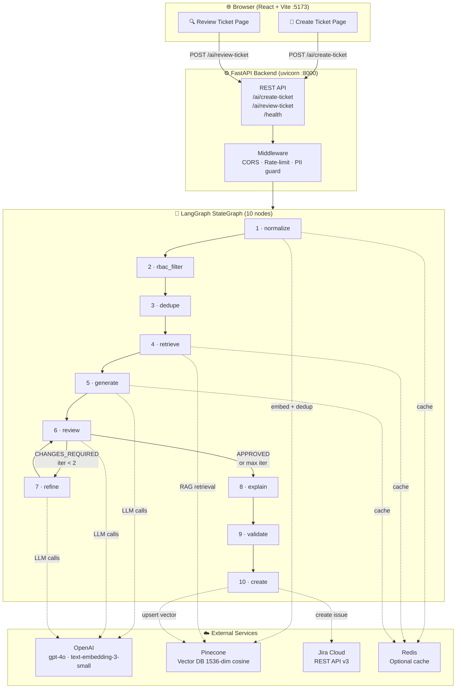
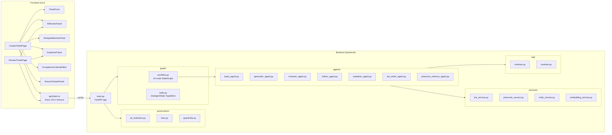
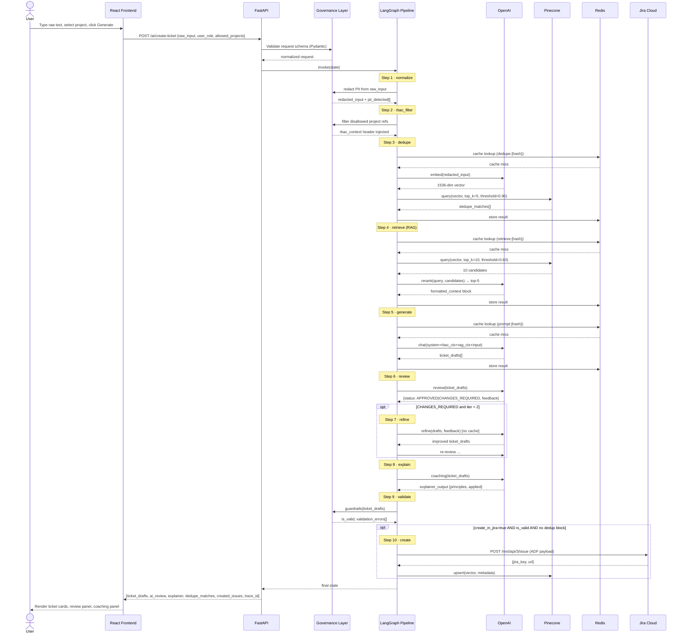
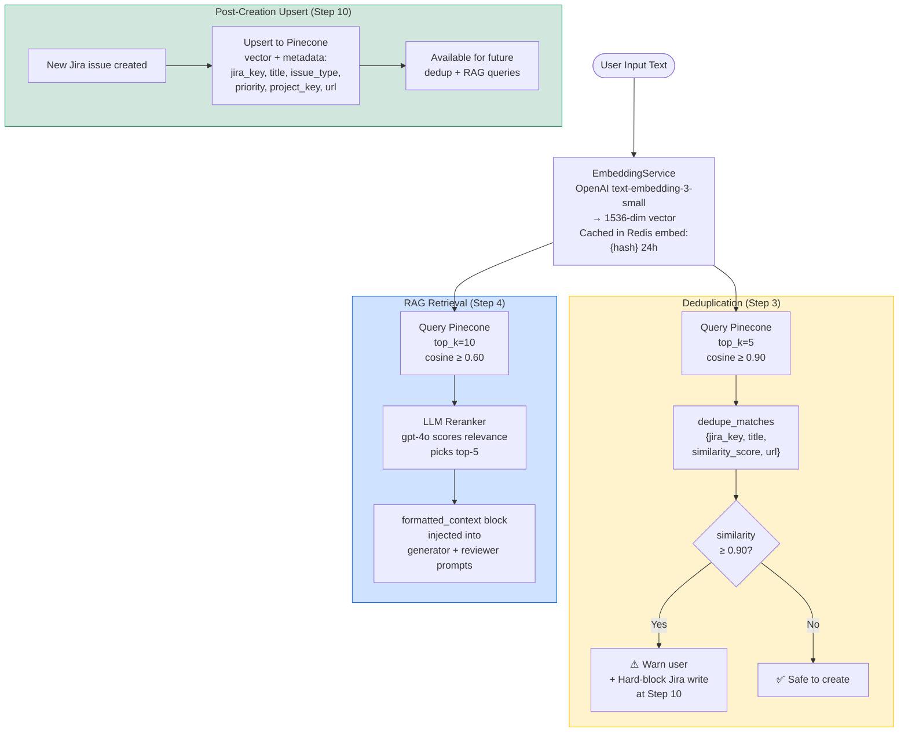
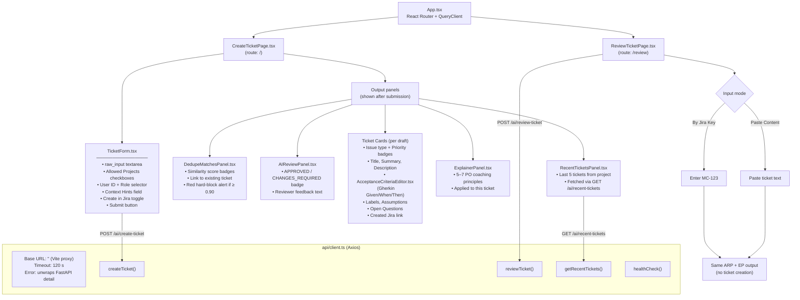

# Jira AI Automation Agent

An enterprise-grade, multi-agent system that converts raw text (support tickets, meeting notes, complaints, logs) into production-quality Jira tickets — with AI review, deduplication, RAG grounding, PII redaction, RBAC enforcement, and optional direct Jira write.

---

## Table of Contents

1. [System Architecture](#1-system-architecture)
2. [Step-by-Step Agent Pipeline](#2-step-by-step-agent-pipeline)
3. [Component Breakdown](#3-component-breakdown)
4. [Data Flow — Request to Response](#4-data-flow--request-to-response)
5. [Governance & Safety Layers](#5-governance--safety-layers)
6. [RAG & Deduplication Pipeline](#6-rag--deduplication-pipeline)
7. [Frontend Component Map](#7-frontend-component-map)
8. [Project Structure](#8-project-structure)
9. [Prerequisites](#9-prerequisites)
10. [Environment Setup](#10-environment-setup)
11. [Running the Application](#11-running-the-application)
12. [API Reference](#12-api-reference)
13. [Observability](#13-observability)
14. [Configuration Reference](#14-configuration-reference)
15. [Key Design Decisions](#15-key-design-decisions)
16. [Troubleshooting](#16-troubleshooting)

---

## 1. System Architecture

The system has three tiers: a **React frontend**, a **FastAPI backend**, and a **LangGraph multi-agent pipeline** that coordinates all AI work. Four external services handle LLM inference, vector storage, ticket writing, and caching.




### Technology Stack

| Layer | Technology |
|---|---|
| Frontend | React 18, TypeScript, Vite 5, Tailwind CSS 3, TanStack Query v5, Axios |
| Backend API | FastAPI 0.115, Uvicorn, Pydantic v2 |
| Agent Orchestration | LangGraph 0.2, LangChain 0.3 |
| LLM | OpenAI `gpt-4o` (JSON mode) |
| Embeddings | OpenAI `text-embedding-3-small` (1536 dim) |
| Vector DB | Pinecone (serverless, cosine) |
| Cache | Redis (optional — degrades gracefully if absent) |
| Ticket System | Jira Cloud REST API v3 (ADF format) |
| PII Redaction | Microsoft Presidio + regex fallback |
| Observability | LangSmith (optional) |

---

## 2. Step-by-Step Agent Pipeline

Every `POST /ai/create-ticket` request travels through exactly **10 ordered nodes**. The diagram below shows the full flow including the review→refine feedback loop.

```mermaid
flowchart TD
    IN(["📥 Raw user input\n(free-form text)"])

    IN --> S1

    S1["**Step 1 · normalize_inputs**\n──────────────────────\n• Redact PII via Presidio / regex\n  e.g. john@corp.com → &lt;EMAIL&gt;\n• Assign unique trace_id\n• Store normalized_input in state"]

    S1 --> S2

    S2["**Step 2 · rbac_filter**\n──────────────────────\n• Remove disallowed Jira project refs\n• Inject role-based context header\n  into every downstream prompt\n• Log rbac_violations to state"]

    S2 --> S3

    S3["**Step 3 · dedupe**\n──────────────────────\n• Embed input with text-embedding-3-small\n• Query Pinecone for cosine similarity\n• Matches ≥ 0.90 → stored as dedupe_matches\n• Hard-blocks Jira write at Step 10"]

    S3 --> S4

    S4["**Step 4 · retrieve**\n──────────────────────\n• RAG: query Pinecone top-10 (≥ 0.60)\n• LLM reranker picks best 5\n• Formats context block injected\n  into generator + reviewer prompts"]

    S4 --> S5

    S5["**Step 5 · generate**\n──────────────────────\n• gpt-4o → produces 1-N ticket drafts\n• Each draft contains:\n  title, summary, description,\n  acceptance criteria (Gherkin),\n  priority, labels, assumptions,\n  open questions, project_key"]

    S5 --> S6

    S6{"**Step 6 · review**\n──────────────────\ngpt-4o evaluates:\n• Clarity & completeness\n• AC quality\n• Priority justification\n• RBAC compliance\n• Dedup signals"}

    S6 -->|"CHANGES_REQUIRED\nand iteration_count < 2"| S7
    S6 -->|"APPROVED\nor iteration_count ≥ 2"| S8

    S7["**Step 7 · refine**\n──────────────────────\n• gpt-4o applies reviewer feedback\n• use_cache=False  always fresh\n• Increments iteration_count\n• Returns updated ticket_drafts"]

    S7 --> S6

    S8["**Step 8 · explain**\n──────────────────────\n• gpt-4o generates 5–7 PO coaching\n  principles for high-quality tickets\n• Applied to THIS ticket specifically\n• Returned as how_to_create_explainer"]

    S8 --> S9

    S9["**Step 9 · validate**\n──────────────────────\n• Guardrails check:\n  – title: 5–255 chars\n  – issue_type: Epic|Story|Bug|Task|Sub-task\n  – priority: P0|P1|P2|P3\n  – linked_epic_key: ^[A-Z]+-\\d+$ or null\n  – description non-empty\n• Sets is_valid flag"]

    S9 --> S10

    S10["**Step 10 · create**\n──────────────────────\n• If create_in_jira=true AND is_valid\n  AND no hard dedupe block:\n  – Write to Jira REST v3 (ADF format)\n  – Upsert vector into Pinecone\n• Collects created_issues per ticket"]

    S10 --> OUT

    OUT(["📤 API Response\nticket_drafts · ai_review\nexplainer · dedupe_matches\ncreated_issues · trace_id"])

    style S6 fill:#fff3cd,stroke:#ffc107
    style S7 fill:#cfe2ff,stroke:#0d6efd
    style S3 fill:#f8d7da,stroke:#dc3545
    style S10 fill:#d1e7dd,stroke:#198754
```



### Agent Responsibilities

| Agent | File | Role |
|---|---|---|
| **Generator** | `agents/generator_agent.py` | Produces full ticket drafts from raw text + RAG context |
| **Reviewer** | `agents/reviewer_agent.py` | Evaluates quality; returns APPROVED or CHANGES_REQUIRED + feedback |
| **Refiner** | `agents/refiner_agent.py` | Improves drafts per reviewer feedback; `use_cache=False` always |
| **Explainer** | `agents/explainer_agent.py` | Coaches Product Owners on ticket quality principles |
| **JiraWriter** | `agents/jira_writer_agent.py` | Maps drafts to Jira ADF format; per-ticket error isolation |
| **PineconeMemory** | `agents/pinecone_memory_agent.py` | Dedup queries + upsert after Jira creation |
| **BaseAgent** | `agents/base_agent.py` | Shared: OpenAI async call, Redis prompt cache (SHA-256 keyed), JSON mode |

---

## 3. Component Breakdown



---

## 4. Data Flow — Request to Response

The following shows how data transforms as it passes through each layer.



---

## 5. Governance & Safety Layers

Three independent safety mechanisms run at different points in the pipeline.

```mermaid
flowchart LR
    IN(["Raw Input"])

    subgraph L1["Layer 1 · PII Redaction\n(before any LLM call)"]
        P1["Microsoft Presidio\n(if installed)"]
        P2["Regex fallback\n(always runs)"]
        P1 & P2 --> MASK["Mask:\n&lt;EMAIL&gt; &lt;PHONE&gt; &lt;SSN&gt;\n&lt;CREDIT_CARD&gt; &lt;IP&gt;"]
    end

    subgraph L2["Layer 2 · RBAC\n(before generation)"]
        R1["Strip disallowed\nproject key refs"]
        R2["Inject role header\ninto every prompt:\nuser_role, allowed_projects,\nallowed_components"]
    end

    subgraph L3["Layer 3 · Output Guardrails\n(after generation, before Jira write)"]
        G1["title: 5–255 chars"]
        G2["issue_type:\nEpic|Story|Bug|Task|Sub-task"]
        G3["priority: P0|P1|P2|P3"]
        G4["linked_epic_key:\n^[A-Z]+-\\d+$ or null"]
        G5["description non-empty"]
        G6["Strip LLM markdown\ncode fences"]
    end

    subgraph L4["Layer 4 · Hard Dedup Block\n(at Jira write)"]
        D1["cosine similarity ≥ 0.90\nagainst existing tickets\n→ block write regardless\nof LLM approval"]
    end

    IN --> L1 --> L2 --> LLM(["LLM Agents"]) --> L3 --> L4 --> OUT(["Jira Write"])

    style L1 fill:#fff3cd,stroke:#ffc107
    style L2 fill:#cfe2ff,stroke:#0d6efd
    style L3 fill:#d1e7dd,stroke:#198754
    style L4 fill:#f8d7da,stroke:#dc3545
```



| Layer | File | When | What it catches |
|---|---|---|---|
| **PII Redaction** | `governance/pii_redaction.py` | Input, before all LLM calls | Emails, phones, SSNs, credit cards, IPs, names |
| **RBAC** | `governance/rbac.py` | Input, before generation | Unauthorized project references, role violations |
| **Guardrails** | `governance/guardrails.py` | Output, after generation | Bad enums, oversized fields, malformed keys |
| **Dedup block** | `agents/pinecone_memory_agent.py` | At Jira write | Cosine ≥ 0.90 matches hard-blocked |

---

## 6. RAG & Deduplication Pipeline

Both RAG retrieval and deduplication share the same embedding infrastructure but use different similarity thresholds and purposes.



### Redis Cache Namespaces

All four namespaces use SHA-256 keyed entries with a 24-hour TTL. Redis is optional — cache misses silently degrade to direct calls.

| Namespace key | Caches | Benefit |
|---|---|---|
| `embed:{hash}` | text → 1536-dim vector | Avoids re-embedding identical text |
| `prompt:{hash}` | LLM prompt → response | Skips LLM call for identical prompts |
| `retrieve:{hash}` | query → Pinecone top-10 results | Avoids repeat vector DB queries |
| `dedupe:{hash}` | input → dedup match list | Instant dedup for known inputs |

---

## 7. Frontend Component Map



---

## 8. Project Structure

```
JiraAutomationAgent/
├── .env                          # API keys and config (never commit)
├── .vscode/
│   └── tasks.json                # Auto-start both servers on folder open
├── start.ps1                     # One-command start (outside VS Code)
│
├── backend/
│   ├── main.py                   # FastAPI app, CORS, endpoints
│   ├── config.py                 # Pydantic Settings (reads .env)
│   ├── requirements.txt
│   │
│   ├── agents/                   # All LLM agents
│   │   ├── base_agent.py         # Shared OpenAI + Redis cache logic
│   │   ├── generator_agent.py
│   │   ├── reviewer_agent.py
│   │   ├── refiner_agent.py
│   │   ├── explainer_agent.py
│   │   ├── jira_writer_agent.py
│   │   └── pinecone_memory_agent.py
│   │
│   ├── graph/
│   │   ├── state.py              # LangGraph TypedDict state definition
│   │   └── workflow.py           # 10-node StateGraph
│   │
│   ├── governance/
│   │   ├── guardrails.py         # Field validation, enum + key format checks
│   │   ├── pii_redaction.py      # Presidio + regex PII masking
│   │   └── rbac.py               # Project-key + role enforcement
│   │
│   ├── rag/
│   │   ├── retriever.py          # Pinecone retrieval + Redis cache
│   │   └── reranker.py           # LLM-based result reranking
│   │
│   ├── services/
│   │   ├── jira_service.py       # Jira Cloud REST v3 client (ADF)
│   │   ├── pinecone_service.py   # Pinecone index client
│   │   ├── redis_service.py      # Async Redis, 4 cache namespaces
│   │   └── embedding_service.py  # OpenAI embedding wrapper
│   │
│   ├── schemas/
│   │   ├── api_schema.py         # FastAPI request/response models
│   │   └── ticket_schema.py      # TicketDraft Pydantic model
│   │
│   ├── observability/
│   │   └── tracer.py             # LangSmith @traceable decorators
│   │
│   └── evaluation/
│       ├── llm_evaluation.py     # DeepEval LLM quality metrics
│       └── rag_evaluation.py     # Ragas RAG evaluation metrics
│
└── frontend/
    ├── vite.config.ts            # Vite dev server + /ai and /health proxy
    ├── tailwind.config.js
    ├── package.json
    └── src/
        ├── App.tsx               # Router + QueryClient setup
        ├── index.tsx             # React entry point
        ├── api/
        │   └── client.ts         # Axios instance, error normalisation
        ├── components/
        │   ├── TicketForm.tsx              # Main creation form
        │   ├── AIReviewPanel.tsx           # Review verdict display
        │   ├── ExplainerPanel.tsx          # PO coaching output
        │   ├── DedupeMatchesPanel.tsx      # Duplicate warnings
        │   └── AcceptanceCriteriaEditor.tsx
        ├── pages/
        │   ├── CreateTicketPage.tsx
        │   └── ReviewTicketPage.tsx
        └── types/
            └── index.ts          # TypeScript interfaces (mirrors Pydantic models)
```

---

## 9. Prerequisites

| Requirement | Minimum Version | Notes |
|---|---|---|
| Python | 3.11+ | venv recommended |
| Node.js | 18+ | npm 9+ |
| OpenAI API key | — | `gpt-4o` + `text-embedding-3-small` access required |
| Pinecone account | — | Free tier sufficient; create a 1536-dim serverless index |
| Jira Cloud account | — | API token from [id.atlassian.com](https://id.atlassian.com/manage-profile/security/api-tokens) |
| Redis | 7+ | **Optional** — system runs without it (cache misses only) |
| LangSmith account | — | **Optional** — for LLM tracing |

---

## 10. Environment Setup

### 10.1 Clone and enter the project

```powershell
git clone <repo-url>
cd JiraAutomationAgent
```

### 10.2 Create the `.env` file

Create `.env` in the project root (same level as `backend/`):

```env
# ── OpenAI ────────────────────────────────────────────────────────────────────
OPENAI_API_KEY=sk-...
OPENAI_MODEL=gpt-4o
OPENAI_EMBEDDING_MODEL=text-embedding-3-small

# ── Pinecone ──────────────────────────────────────────────────────────────────
PINECONE_API_KEY=pcsk_...
PINECONE_INDEX_NAME=mortgageindex        # or your index name
PINECONE_ENVIRONMENT=us-east-1

# ── Jira ──────────────────────────────────────────────────────────────────────
JIRA_BASE_URL=https://yourorg.atlassian.net
JIRA_EMAIL=you@example.com
JIRA_API_TOKEN=ATATT...
JIRA_DEFAULT_PROJECT=MC                  # your default project key

# ── RBAC ──────────────────────────────────────────────────────────────────────
ALLOWED_PROJECTS=MC,PROJ,INFRA,PLATFORM  # comma-separated list

# ── Redis (optional) ──────────────────────────────────────────────────────────
REDIS_URL=redis://localhost:6379
REDIS_TTL=86400

# ── LangSmith (optional) ──────────────────────────────────────────────────────
LANGCHAIN_API_KEY=ls__...
LANGCHAIN_TRACING_V2=true
LANGCHAIN_PROJECT=jira-automation-agent
```

> **Security**: Never commit `.env`. Add it to `.gitignore`.

### 10.3 Backend Python environment

```powershell
cd backend
python -m venv .venv

# Windows
.venv\Scripts\activate
# macOS/Linux
# source .venv/bin/activate

pip install -r requirements.txt

# Optional: full Presidio PII detection (otherwise regex fallback is used)
python -m spacy download en_core_web_lg
```

### 10.4 Pinecone index

Create a serverless index with these settings:

| Setting | Value |
|---|---|
| Dimensions | `1536` |
| Metric | `cosine` |
| Type | Serverless (AWS us-east-1 recommended) |

```python
from pinecone import Pinecone, ServerlessSpec
pc = Pinecone(api_key="<your-key>")
pc.create_index(
    name="mortgageindex",
    dimension=1536,
    metric="cosine",
    spec=ServerlessSpec(cloud="aws", region="us-east-1")
)
```

### 10.5 Frontend

```powershell
cd frontend
npm install
```

---

## 11. Running the Application

### Option A — VS Code (fully automatic)

The workspace is configured via `.vscode/tasks.json` to auto-start both servers when you open the folder.

1. Open the folder: `code .` or **File → Open Folder**
2. When prompted *"This workspace has tasks configured to run on folder open"* → click **Allow**
3. Two dedicated terminal panels open automatically:
   - **Backend (uvicorn :8000)**
   - **Frontend (Vite :5173)**
4. Open **http://localhost:5173**

To trigger manually: `Ctrl+Shift+P` → **Tasks: Run Task** → **Start All**

### Option B — Single PowerShell command

```powershell
.\start.ps1
```

Opens two separate PowerShell windows — one per server.

### Option C — Manual (two terminals)

**Terminal 1 — Backend:**
```powershell
cd JiraAutomationAgent
backend\.venv\Scripts\uvicorn.exe backend.main:app --port 8000 --log-level warning
```

**Terminal 2 — Frontend:**
```powershell
cd JiraAutomationAgent\frontend
npm run dev
```

### Verify startup

```powershell
Invoke-RestMethod http://localhost:8000/health
```

Expected:
```json
{
  "status": "degraded",
  "services": {
    "redis": "degraded",    // expected without local Redis — non-fatal
    "pinecone": "ok",
    "jira": "ok"
  }
}
```

---

## 12. API Reference

Interactive docs (Swagger UI): **http://localhost:8000/docs**

### POST `/ai/create-ticket`

Runs the full 10-node agent pipeline and returns structured ticket drafts.

**Request:**
```json
{
  "raw_input": "Login page crashes on iPhone 15 after entering password",
  "user_id": "po-user-1",
  "user_role": "product_owner",
  "allowed_projects": ["MC"],
  "allowed_components": [],
  "context_hints": "iOS mobile app, authentication module",
  "create_in_jira": false
}
```

| Field | Type | Required | Description |
|---|---|---|---|
| `raw_input` | string | ✅ | Free-form text to convert |
| `user_id` | string | ✅ | Caller identity for audit logging |
| `user_role` | string | ✅ | `product_owner` \| `engineer` \| `qa` \| `admin` |
| `allowed_projects` | string[] | ✅ | RBAC project scope |
| `allowed_components` | string[] | ✅ | Component scope (empty = all) |
| `context_hints` | string | — | Extra grounding text |
| `create_in_jira` | boolean | — | `true` to write approved tickets to Jira (default: `false`) |

**Response:**
```json
{
  "tickets": [{
    "title": "Fix login crash on iPhone 15 post-password entry",
    "summary": "...",
    "description": "...",
    "issue_type": "Bug",
    "priority": "P1",
    "priority_reasoning": "...",
    "acceptance_criteria": ["...", "..."],
    "labels": ["mobile", "auth"],
    "assumptions": ["..."],
    "open_questions": ["..."],
    "linked_epic_key": null
  }],
  "review": { "status": "APPROVED", "feedback": "..." },
  "explanation": {
    "principles": ["..."],
    "applied_to_this_ticket": ["..."]
  },
  "dedupe_matches": [],
  "created_issues": [],
  "pii_detected": [],
  "rbac_violations": [],
  "trace_id": "uuid"
}
```

### POST `/ai/review-ticket`

Reviews an existing Jira ticket by key or pasted content.

```json
{
  "jira_key": "MC-5",
  "ticket_content": null,
  "user_id": "po-user-1",
  "user_role": "product_owner",
  "allowed_projects": ["MC"],
  "allowed_components": []
}
```

### GET `/health`

Returns service connectivity for Redis, Pinecone, and Jira.

### GET `/ai/recent-tickets?project=MC&limit=5`

Returns the last N tickets from the specified project (capped at 20).

---

## 13. Observability

### LangSmith

Set `LANGCHAIN_API_KEY` and `LANGCHAIN_TRACING_V2=true`. Every LLM call is traced automatically. View at **https://smith.langchain.com** under project `jira-automation-agent`.

### Backend Logging

All 10 nodes emit structured lines at `INFO` level:

```
[WORKFLOW·normalize]  trace=abc-123  pii_count=2
[AGENT·generator]     trace=abc-123  drafts=1  tokens=847
[AGENT·reviewer]      trace=abc-123  status=APPROVED  iteration=1
[WORKFLOW·create]     trace=abc-123  jira_key=MC-124  url=https://...
```

Pass `--log-level info` to uvicorn to see all pipeline steps.

### Redis Cache Events

Each cache hit/miss is logged at `INFO` level:

```
[CACHE·embed]    MISS  key=embed:3a9f...
[CACHE·prompt]   HIT   key=prompt:7bc2...
```

### Evaluation

```powershell
# RAG evaluation (Ragas metrics)
python -m backend.evaluation.rag_evaluation

# LLM quality evaluation (DeepEval)
python -m backend.evaluation.llm_evaluation
```

---

## 14. Configuration Reference

| Variable | Default | Description |
|---|---|---|
| `OPENAI_API_KEY` | — | Required |
| `OPENAI_MODEL` | `gpt-4o` | Chat model |
| `OPENAI_EMBEDDING_MODEL` | `text-embedding-3-small` | Embedding model |
| `PINECONE_API_KEY` | — | Required |
| `PINECONE_INDEX_NAME` | `jira-issues` | Index to query/upsert |
| `PINECONE_ENVIRONMENT` | `us-east-1` | Pinecone region |
| `PINECONE_DIMENSION` | `1536` | Must match embedding model |
| `REDIS_URL` | `redis://localhost:6379` | Optional |
| `REDIS_TTL` | `86400` | Cache TTL (seconds) |
| `JIRA_BASE_URL` | — | Required, e.g. `https://org.atlassian.net` |
| `JIRA_EMAIL` | — | Required |
| `JIRA_API_TOKEN` | — | Required |
| `JIRA_DEFAULT_PROJECT` | `PROJ` | Fallback project key |
| `ALLOWED_PROJECTS` | `PROJ,INFRA,PLATFORM` | CSV — overrides default RBAC allow-list |
| `LANGCHAIN_API_KEY` | — | Optional (LangSmith) |
| `LANGCHAIN_TRACING_V2` | `true` | Enable LangSmith traces |
| `LANGCHAIN_PROJECT` | `jira-automation-agent` | LangSmith project name |

---

## 15. Key Design Decisions

| Decision | Rationale |
|---|---|
| **LangGraph** over plain chains | Stateful, cyclical orchestration with conditional edges; review→refine loop capped at `max_iterations=2` |
| **Redis caching at 4 layers** | SHA-256-keyed prompt, embedding, retrieval, and dedup caches with 24 h TTL reduce OpenAI costs on repeated inputs |
| **Pinecone cosine thresholds** | ≥ 0.90 for dedup hard-block; ≥ 0.60 for RAG advisory retrieval |
| **JSON mode on all LLM calls** | `response_format={"type": "json_object"}` eliminates markdown-wrapped JSON responses |
| **Presidio + regex fallback** | No PII ever reaches the LLM; works even without the spaCy model installed |
| **Atlassian Document Format (ADF)** | Required by Jira REST API v3; descriptions rendered with Gherkin-format acceptance criteria |
| **Vite proxy** | Frontend API calls go to the same origin (`''`), forwarded by Vite to port 8000 — no CORS headers needed in development |
| **`create_in_jira` opt-in** | Defaults to `false` so the entire pipeline is safe as a preview/dry-run without any Jira side-effects |
| **Hard dedup block at create node** | Duplicates blocked at `create_node` **regardless of LLM review**, preventing a soft reviewer from approving clear duplicates |
| **Per-ticket error isolation in JiraWriter** | One Jira API failure does not abort other tickets in the same batch |

---

## 16. Troubleshooting

### Generate button does nothing

Confirm both servers are running:

```powershell
# Backend
Invoke-RestMethod http://localhost:8000/health

# Frontend
Invoke-WebRequest http://localhost:5173 -UseBasicParsing | Select-Object StatusCode
```

Restart if needed:
```powershell
# Backend
backend\.venv\Scripts\uvicorn.exe backend.main:app --port 8000 --log-level warning
# Frontend (separate terminal)
cd frontend; npm run dev
```

### MC project rejected / RBAC violation in logs

Ensure `.env` contains:
```env
ALLOWED_PROJECTS=MC,PROJ,INFRA,PLATFORM
```
Then restart the backend to reload config.

### Port 8000 already in use

```powershell
Get-Process -Name uvicorn | Stop-Process -Force
```

### Port 5173 already in use

```powershell
$p = (Get-NetTCPConnection -LocalPort 5173 -State Listen).OwningProcess
Stop-Process -Id $p -Force
```

### `redis=degraded` in health check

Expected without a local Redis instance — all cache operations silently no-op. To run Redis locally:

```powershell
docker run -d -p 6379:6379 redis:7-alpine
```

### Presidio warning on startup

```
presidio-analyzer / presidio-anonymizer not installed. Falling back to regex-based PII redaction.
```

Non-fatal. To enable full Presidio:
```powershell
pip install presidio-analyzer presidio-anonymizer
python -m spacy download en_core_web_lg
```

### TypeScript errors

```powershell
cd frontend
npx tsc --noEmit
```
│                                                                             │
│   ┌──────────────────────┐          ┌─────────────────────────────────┐     │
│   │  Create Ticket Page  │          │     Review Ticket Page          │     │
│   │  TicketForm.tsx      │          │     ReviewTicketPage.tsx        │     │
│   └──────────┬───────────┘          └──────────────┬──────────────────┘     │
│              │ POST /ai/create-ticket               │ POST /ai/review-ticket │
└──────────────┼──────────────────────────────────────┼────────────────────────┘
               │   (Vite proxy → localhost:8000)       │
               ▼                                       ▼
┌─────────────────────────────────────────────────────────────────────────────┐
│                        FASTAPI  (uvicorn :8000)                             │
│                                                                             │
│   CORS · Global Exception Handler · Pydantic Validation · RBAC State Init  │
└─────────────────────────────────────┬───────────────────────────────────────┘
                                      │
                                      ▼
┌─────────────────────────────────────────────────────────────────────────────┐
│                     LANGGRAPH  StateGraph  (10 nodes)                       │
│                                                                             │
│  normalize_inputs ──► rbac_filter ──► dedupe ──► retrieve ──► generate     │
│                                                                      │      │
│                    ┌─────── review ◄──────── refine ◄───────────────┘      │
│                    │  (APPROVED or max_iter=2)                              │
│                    └──────────────► explain ──► validate ──► create ──► END │
└────────┬──────────────────────────────────────────────────────────┬─────────┘
         │                                                          │
         ▼                                                          ▼
┌─────────────────────┐   ┌──────────────┐   ┌────────────────────────────────┐
│  OpenAI  gpt-4o     │   │  Pinecone    │   │   Jira Cloud REST API v3       │
│  text-embed-3-small │   │  (vector DB) │   │   yourorg.atlassian.net        │
└─────────────────────┘   └──────┬───────┘   └────────────────────────────────┘
                                 │
                          ┌──────┴───────┐
                          │  Redis       │
                          │  (optional)  │
                          │  prompt &    │
                          │  embed cache │
                          └──────────────┘
```

### Technology Stack

| Layer | Technology |
|---|---|
| Frontend | React 18, TypeScript, Vite 5, Tailwind CSS 3, TanStack Query v5, Axios |
| Backend API | FastAPI 0.115, Uvicorn, Pydantic v2 |
| Agent Orchestration | LangGraph 0.2, LangChain 0.3 |
| LLM | OpenAI `gpt-4o` (JSON mode) |
| Embeddings | OpenAI `text-embedding-3-small` (1536 dim) |
| Vector DB | Pinecone (serverless) |
| Cache | Redis (optional — degrades gracefully if absent) |
| Ticket System | Jira Cloud REST API v3 (ADF format) |
| PII Redaction | Microsoft Presidio + regex fallback |
| Observability | LangSmith (optional) |

---

## 2. Agent Pipeline Deep-Dive

```
raw text input
     │
     ▼
╔════════════════╗
║ 1. normalize   ║  PII redaction (Presidio/regex), trace-ID assignment
╚════════════════╝
     │
     ▼
╔════════════════╗
║ 2. rbac_filter ║  Project-key scoping, role-based context injection
╚════════════════╝
     │
     ▼
╔════════════════╗
║ 3. dedupe      ║  Embed input → Pinecone ANN search (cosine ≥ 0.85)
╚════════════════╝   Redis cache-aside for repeat queries
     │
     ▼
╔════════════════╗
║ 4. retrieve    ║  RAG: top-10 from Pinecone → LLM reranker → top-5
╚════════════════╝   formatted context block injected into every prompt
     │
     ▼
╔════════════════╗
║ 5. generate    ║  gpt-4o → 1-N ticket drafts
╚════════════════╝   (title, summary, description, AC, priority, labels…)
     │
     ▼
╔════════════════╗
║ 6. review      ║  gpt-4o evaluates draft quality + dedup signals
╚════════════════╝   returns: {status: APPROVED|CHANGES_REQUIRED, feedback}
     │
     ├─── CHANGES_REQUIRED (max 2 iterations) ─────────────────►
     │                                                    ╔══════════╗
     │                                                    ║ 7. refine ║
     │                                                    ╚══════════╝
     │◄───────────────────────────────────────────────────────┘
     │
     │─── APPROVED (or iterations exhausted) ───────────────────►
     ▼
╔════════════════╗
║ 8. explain     ║  gpt-4o generates PO coaching: principles + application
╚════════════════╝
     │
     ▼
╔════════════════╗
║ 9. validate    ║  Guardrails: field lengths, enum values, key format
╚════════════════╝
     │
     ▼
╔════════════════╗
║ 10. create     ║  Jira REST write (only if create_in_jira=True + valid)
╚════════════════╝   → Pinecone upsert for future dedup
     │
     ▼
  API response  →  {tickets, review, explanation, dedupe_matches, created_issues}
```

### Agent Responsibilities

| Agent | File | Role |
|---|---|---|
| **Generator** | `agents/generator_agent.py` | Produces full ticket drafts from raw text + RAG context |
| **Reviewer** | `agents/reviewer_agent.py` | Evaluates quality; returns APPROVED or CHANGES_REQUIRED + feedback |
| **Refiner** | `agents/refiner_agent.py` | Improves drafts per reviewer feedback; `use_cache=False` always |
| **Explainer** | `agents/explainer_agent.py` | Coaches Product Owners on ticket quality principles |
| **JiraWriter** | `agents/jira_writer_agent.py` | Maps drafts to Jira ADF format; per-ticket error isolation |
| **PineconeMemory** | `agents/pinecone_memory_agent.py` | Dedup queries + upsert after Jira creation |
| **BaseAgent** | `agents/base_agent.py` | Shared: OpenAI call, Redis prompt cache, JSON mode |

---

## 3. Project Structure

```
JiraAutomationAgent/
├── .env                          # API keys and config (never commit)
├── .vscode/
│   └── tasks.json                # Auto-start both servers on folder open
├── start.ps1                     # One-command start (outside VS Code)
│
├── backend/
│   ├── main.py                   # FastAPI app, CORS, endpoints
│   ├── config.py                 # Pydantic Settings (reads .env)
│   ├── requirements.txt
│   │
│   ├── agents/                   # All LLM agents
│   │   ├── base_agent.py         # Shared OpenAI + Redis cache logic
│   │   ├── generator_agent.py
│   │   ├── reviewer_agent.py
│   │   ├── refiner_agent.py
│   │   ├── explainer_agent.py
│   │   ├── jira_writer_agent.py
│   │   └── pinecone_memory_agent.py
│   │
│   ├── graph/
│   │   ├── state.py              # LangGraph TypedDict state definition
│   │   └── workflow.py           # 10-node StateGraph
│   │
│   ├── governance/
│   │   ├── guardrails.py         # Field validation, enum + key format checks
│   │   ├── pii_redaction.py      # Presidio + regex PII masking
│   │   └── rbac.py               # Project-key + role enforcement
│   │
│   ├── rag/
│   │   ├── retriever.py          # Pinecone retrieval + Redis cache
│   │   └── reranker.py           # LLM-based result reranking
│   │
│   ├── services/
│   │   ├── jira_service.py       # Jira Cloud REST v3 client (ADF)
│   │   ├── pinecone_service.py   # Pinecone index client
│   │   ├── redis_service.py      # Async Redis, 4 cache namespaces
│   │   └── embedding_service.py  # OpenAI embedding wrapper
│   │
│   ├── schemas/
│   │   ├── api_schema.py         # FastAPI request/response models
│   │   └── ticket_schema.py      # TicketDraft Pydantic model
│   │
│   ├── observability/
│   │   └── tracer.py             # LangSmith @traceable decorators
│   │
│   └── evaluation/
│       ├── llm_evaluation.py     # DeepEval LLM quality metrics
│       └── rag_evaluation.py     # Ragas RAG evaluation metrics
│
└── frontend/
    ├── vite.config.ts            # Vite dev server + /ai and /health proxy
    ├── tailwind.config.js
    ├── package.json
    └── src/
        ├── App.tsx               # Router + QueryClient setup
        ├── index.tsx             # React entry point
        ├── api/
        │   └── client.ts         # Axios instance, error normalisation
        ├── components/
        │   ├── TicketForm.tsx              # Main creation form
        │   ├── AIReviewPanel.tsx           # Review verdict display
        │   ├── ExplainerPanel.tsx          # PO coaching output
        │   ├── DedupeMatchesPanel.tsx      # Duplicate warnings
        │   └── AcceptanceCriteriaEditor.tsx
        ├── pages/
        │   ├── CreateTicketPage.tsx
        │   └── ReviewTicketPage.tsx
        └── types/
            └── index.ts          # TypeScript interfaces (mirrors Pydantic models)
```

---

## 4. Prerequisites

| Requirement | Minimum Version | Notes |
|---|---|---|
| Python | 3.11+ | venv recommended |
| Node.js | 18+ | npm 9+ |
| OpenAI API key | — | `gpt-4o` + `text-embedding-3-small` access required |
| Pinecone account | — | Free tier sufficient; create a 1536-dim serverless index |
| Jira Cloud account | — | API token from [id.atlassian.com](https://id.atlassian.com/manage-profile/security/api-tokens) |
| Redis | 7+ | **Optional** — system runs without it (cache misses only) |
| LangSmith account | — | **Optional** — for LLM tracing |

---

## 5. Environment Setup

### 5.1 Clone and enter the project

```powershell
git clone <repo-url>
cd JiraAutomationAgent
```

### 5.2 Create the `.env` file

Create `.env` in the project root (same level as `backend/`):

```env
# ── OpenAI ────────────────────────────────────────────────────────────────────
OPENAI_API_KEY=sk-...
OPENAI_MODEL=gpt-4o
OPENAI_EMBEDDING_MODEL=text-embedding-3-small

# ── Pinecone ──────────────────────────────────────────────────────────────────
PINECONE_API_KEY=pcsk_...
PINECONE_INDEX_NAME=mortgageindex        # or your index name
PINECONE_ENVIRONMENT=us-east-1

# ── Jira ──────────────────────────────────────────────────────────────────────
JIRA_BASE_URL=https://yourorg.atlassian.net
JIRA_EMAIL=you@example.com
JIRA_API_TOKEN=ATATT...
JIRA_DEFAULT_PROJECT=MC                  # your default project key

# ── RBAC ──────────────────────────────────────────────────────────────────────
ALLOWED_PROJECTS=MC,PROJ,INFRA,PLATFORM  # comma-separated list

# ── Redis (optional) ──────────────────────────────────────────────────────────
REDIS_URL=redis://localhost:6379
REDIS_TTL=86400

# ── LangSmith (optional) ──────────────────────────────────────────────────────
LANGCHAIN_API_KEY=ls__...
LANGCHAIN_TRACING_V2=true
LANGCHAIN_PROJECT=jira-automation-agent
```

> **Security**: Never commit `.env`. Add it to `.gitignore`.

### 5.3 Backend Python environment

```powershell
cd backend
python -m venv .venv

# Windows
.venv\Scripts\activate
# macOS/Linux
# source .venv/bin/activate

pip install -r requirements.txt

# Optional: full Presidio PII detection (otherwise regex fallback is used)
python -m spacy download en_core_web_lg
```

### 5.4 Pinecone index

Create a serverless index with these settings:

| Setting | Value |
|---|---|
| Dimensions | `1536` |
| Metric | `cosine` |
| Type | Serverless (AWS us-east-1 recommended) |

```python
from pinecone import Pinecone, ServerlessSpec
pc = Pinecone(api_key="<your-key>")
pc.create_index(
    name="mortgageindex",
    dimension=1536,
    metric="cosine",
    spec=ServerlessSpec(cloud="aws", region="us-east-1")
)
```

### 5.5 Frontend

```powershell
cd frontend
npm install
```

---

## 6. Running the Application

### Option A — VS Code (fully automatic)

The workspace is configured via `.vscode/tasks.json` to auto-start both servers when you open the folder.

1. Open the folder: `code .` or **File → Open Folder**
2. When prompted *"This workspace has tasks configured to run on folder open"* → click **Allow**
3. Two dedicated terminal panels open automatically:
   - **Backend (uvicorn :8000)**
   - **Frontend (Vite :5173)**
4. Open **http://localhost:5173**

To trigger manually: `Ctrl+Shift+P` → **Tasks: Run Task** → **Start All**

### Option B — Single PowerShell command

```powershell
.\start.ps1
```

Opens two separate PowerShell windows — one per server.

### Option C — Manual (two terminals)

**Terminal 1 — Backend:**
```powershell
cd JiraAutomationAgent
backend\.venv\Scripts\uvicorn.exe backend.main:app --port 8000 --log-level warning
```

**Terminal 2 — Frontend:**
```powershell
cd JiraAutomationAgent\frontend
npm run dev
```

### Verify startup

```powershell
Invoke-RestMethod http://localhost:8000/health
```

Expected:
```json
{
  "status": "degraded",
  "services": {
    "redis": "degraded",    // expected without local Redis — non-fatal
    "pinecone": "ok",
    "jira": "ok"
  }
}
```

---

## 7. API Reference

Interactive docs (Swagger UI): **http://localhost:8000/docs**

### POST `/ai/create-ticket`

Runs the full 10-node agent pipeline and returns structured ticket drafts.

**Request:**
```json
{
  "raw_input": "Login page crashes on iPhone 15 after entering password",
  "user_id": "po-user-1",
  "user_role": "product_owner",
  "allowed_projects": ["MC"],
  "allowed_components": [],
  "context_hints": "iOS mobile app, authentication module",
  "create_in_jira": false
}
```

| Field | Type | Required | Description |
|---|---|---|---|
| `raw_input` | string | ✅ | Free-form text to convert |
| `user_id` | string | ✅ | Caller identity for audit logging |
| `user_role` | string | ✅ | `product_owner` \| `engineer` \| `qa` \| `admin` |
| `allowed_projects` | string[] | ✅ | RBAC project scope |
| `allowed_components` | string[] | ✅ | Component scope (empty = all) |
| `context_hints` | string | — | Extra grounding text |
| `create_in_jira` | boolean | — | `true` to write approved tickets to Jira (default: `false`) |

**Response:**
```json
{
  "tickets": [{
    "title": "Fix login crash on iPhone 15 post-password entry",
    "summary": "...",
    "description": "...",
    "issue_type": "Bug",
    "priority": "P1",
    "priority_reasoning": "...",
    "acceptance_criteria": ["...", "..."],
    "labels": ["mobile", "auth"],
    "assumptions": ["..."],
    "open_questions": ["..."],
    "linked_epic_key": null
  }],
  "review": { "status": "APPROVED", "feedback": "..." },
  "explanation": {
    "principles": ["..."],
    "applied_to_this_ticket": ["..."]
  },
  "dedupe_matches": [],
  "created_issues": [],
  "pii_detected": [],
  "rbac_violations": [],
  "trace_id": "uuid"
}
```

### POST `/ai/review-ticket`

Reviews an existing Jira ticket by key or pasted content.

```json
{
  "jira_key": "MC-5",
  "ticket_content": null,
  "user_id": "po-user-1",
  "user_role": "product_owner",
  "allowed_projects": ["MC"],
  "allowed_components": []
}
```

### GET `/health`

Returns service connectivity for Redis, Pinecone, and Jira.

---

## 8. Frontend Walkthrough

### Create Ticket (`/`)

1. **Input** — paste any raw text: bug reports, user complaints, meeting notes, log snippets
2. **Allowed Projects** — toggle which Jira project keys the AI may use (`MC` pre-selected)
3. **User / Role** — your identity and role (affects prompt tone and RBAC scope)
4. **Context Hints** — optional extra grounding (e.g. `"iOS 17, payment module"`)
5. **Create in Jira** — when ticked, approved tickets are written directly to Jira Cloud
6. **Generate Ticket(s)** — button shows `Generating…` during the 20-40 s pipeline

After submission you see:
- **Dedupe warnings** — if similar tickets already exist in Pinecone
- **AI Review panel** — APPROVED / CHANGES_REQUIRED verdict + feedback
- **Ticket cards** — expandable cards with title, summary, description, AC, labels, assumptions, open questions
- **Explainer panel** — Product Owner coaching on what makes a high-quality ticket

### Review Ticket (`/review`)

Look up an existing ticket by Jira key (e.g. `MC-5`) or paste content. Returns the same review + coaching output.

---

## 9. Governance & Safety

### PII Redaction

All input passes through `governance/pii_redaction.py` **before** any LLM call. Detected entities (emails, phone numbers, SSNs, credit card numbers, names) are replaced with `[REDACTED]` tokens. Microsoft Presidio is used when installed; a regex fallback runs automatically if not.

### RBAC Enforcement

`governance/rbac.py` enforces:
1. **Project-key scoping** — references to disallowed Jira keys are removed from the prompt before generation
2. **Role context** — each role gets a tailored instruction block injected into every LLM prompt

The `ALLOWED_PROJECTS` env var controls the global allowed list. The per-request `allowed_projects` field provides additional narrowing.

### Output Guardrails (`governance/guardrails.py`)

Runs after generation, before any Jira write:

| Check | Rule |
|---|---|
| Summary length | ≤ 255 characters (Jira limit) |
| `issue_type` | Must be: Epic, Story, Bug, Task, Sub-task |
| `priority` | Must be: P0, P1, P2, P3 |
| `linked_epic_key` | Format: `^[A-Z]+-\d+$` or null |
| JSON fences | Strips LLM markdown code block wrappers |

---

## 10. Observability

### LangSmith

Set `LANGCHAIN_API_KEY` and `LANGCHAIN_TRACING_V2=true`. Every LLM call is traced automatically. View at **https://smith.langchain.com** under project `jira-automation-agent`.

### Backend Logging

All 10 nodes emit structured lines at `INFO` level:

```
2026-05-07 13:51:08  INFO  backend.graph.workflow  [generate] 2 ticket draft(s) produced
2026-05-07 13:51:12  INFO  backend.graph.workflow  [review] Status: APPROVED | Iteration: 1
2026-05-07 13:51:15  INFO  backend.graph.workflow  [create] 1 issue(s) created in Jira
```

Pass `--log-level info` to uvicorn to see all pipeline steps.

### Redis Cache Namespaces

| Namespace | Contents | TTL |
|---|---|---|
| `prompt:` | LLM prompt → response (SHA-256 keyed) | 24 h |
| `embed:` | Text → embedding vector | 24 h |
| `retrieve:` | Query → Pinecone results | 24 h |
| `dedupe:` | Input → dedup matches | 24 h |

### Evaluation

```powershell
# RAG evaluation (Ragas metrics)
python -m backend.evaluation.rag_evaluation

# LLM quality evaluation (DeepEval)
python -m backend.evaluation.llm_evaluation
```

---

## 11. Configuration Reference

| Variable | Default | Description |
|---|---|---|
| `OPENAI_API_KEY` | — | Required |
| `OPENAI_MODEL` | `gpt-4o` | Chat model |
| `OPENAI_EMBEDDING_MODEL` | `text-embedding-3-small` | Embedding model |
| `PINECONE_API_KEY` | — | Required |
| `PINECONE_INDEX_NAME` | `jira-issues` | Index to query/upsert |
| `PINECONE_ENVIRONMENT` | `us-east-1` | Pinecone region |
| `PINECONE_DIMENSION` | `1536` | Must match embedding model |
| `REDIS_URL` | `redis://localhost:6379` | Optional |
| `REDIS_TTL` | `86400` | Cache TTL (seconds) |
| `JIRA_BASE_URL` | — | Required, e.g. `https://org.atlassian.net` |
| `JIRA_EMAIL` | — | Required |
| `JIRA_API_TOKEN` | — | Required |
| `JIRA_DEFAULT_PROJECT` | `PROJ` | Fallback project key |
| `ALLOWED_PROJECTS` | `PROJ,INFRA,PLATFORM` | CSV — overrides default RBAC allow-list |
| `LANGCHAIN_API_KEY` | — | Optional (LangSmith) |
| `LANGCHAIN_TRACING_V2` | `true` | Enable LangSmith traces |
| `LANGCHAIN_PROJECT` | `jira-automation-agent` | LangSmith project name |

---

## 12. Key Design Decisions

| Decision | Rationale |
|---|---|
| **LangGraph** over plain chains | Stateful, cyclical orchestration with conditional edges; review→refine loop capped at `max_iterations=2` |
| **Redis caching at 4 layers** | SHA-256-keyed prompt, embedding, retrieval, and dedup caches with 24 h TTL reduce OpenAI costs on repeated inputs |
| **Pinecone cosine thresholds** | ≥ 0.85 for dedup flagging; ≥ 0.60 for RAG retrieval |
| **JSON mode on all LLM calls** | `response_format={"type": "json_object"}` eliminates markdown-wrapped JSON responses |
| **Presidio + regex fallback** | No PII ever reaches the LLM; works even without the spaCy model installed |
| **Atlassian Document Format (ADF)** | Required by Jira REST API v3; descriptions rendered with Gherkin-format acceptance criteria |
| **Vite proxy** | Frontend API calls go to the same origin (`''`), forwarded by Vite to port 8000 — no CORS headers needed in development |
| **`create_in_jira` opt-in** | Defaults to `false` so the entire pipeline is safe as a preview/dry-run without any Jira side-effects |

---

## 13. Troubleshooting

### Generate button does nothing

Confirm both servers are running:

```powershell
# Backend
Invoke-RestMethod http://localhost:8000/health

# Frontend
Invoke-WebRequest http://localhost:5173 -UseBasicParsing | Select-Object StatusCode
```

Restart if needed:
```powershell
# Backend
backend\.venv\Scripts\uvicorn.exe backend.main:app --port 8000 --log-level warning
# Frontend (separate terminal)
cd frontend; npm run dev
```

### MC project rejected / RBAC violation in logs

Ensure `.env` contains:
```env
ALLOWED_PROJECTS=MC,PROJ,INFRA,PLATFORM
```
Then restart the backend to reload config.

### Port 8000 already in use

```powershell
Get-Process -Name uvicorn | Stop-Process -Force
```

### Port 5173 already in use

```powershell
$p = (Get-NetTCPConnection -LocalPort 5173 -State Listen).OwningProcess
Stop-Process -Id $p -Force
```

### `redis=degraded` in health check

Expected without a local Redis instance — all cache operations silently no-op. To run Redis locally:

```powershell
docker run -d -p 6379:6379 redis:7-alpine
```

### Presidio warning on startup

```
presidio-analyzer / presidio-anonymizer not installed. Falling back to regex-based PII redaction.
```

Non-fatal. To enable full Presidio:
```powershell
pip install presidio-analyzer presidio-anonymizer
python -m spacy download en_core_web_lg
```

### TypeScript errors

```powershell
cd frontend
npx tsc --noEmit
```

---

## License

MIT

