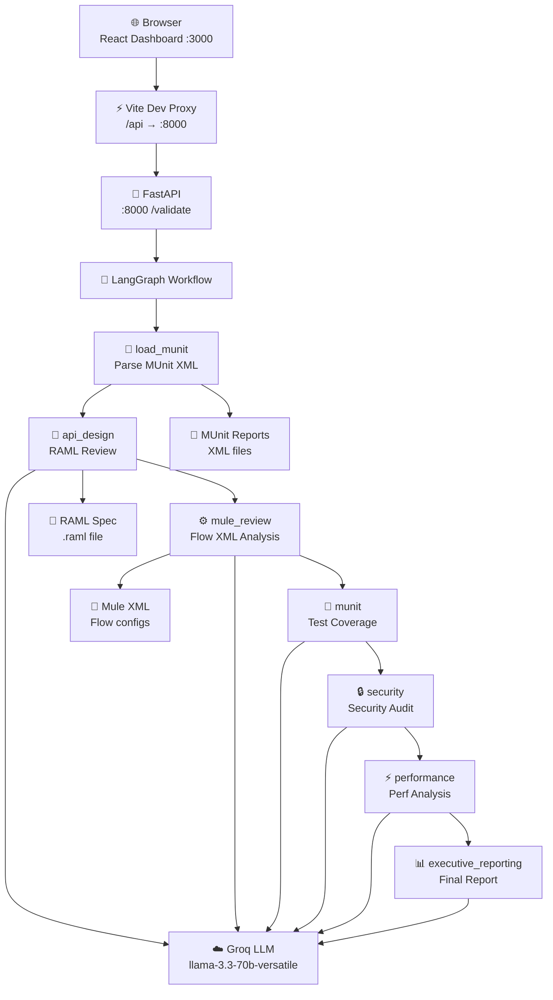
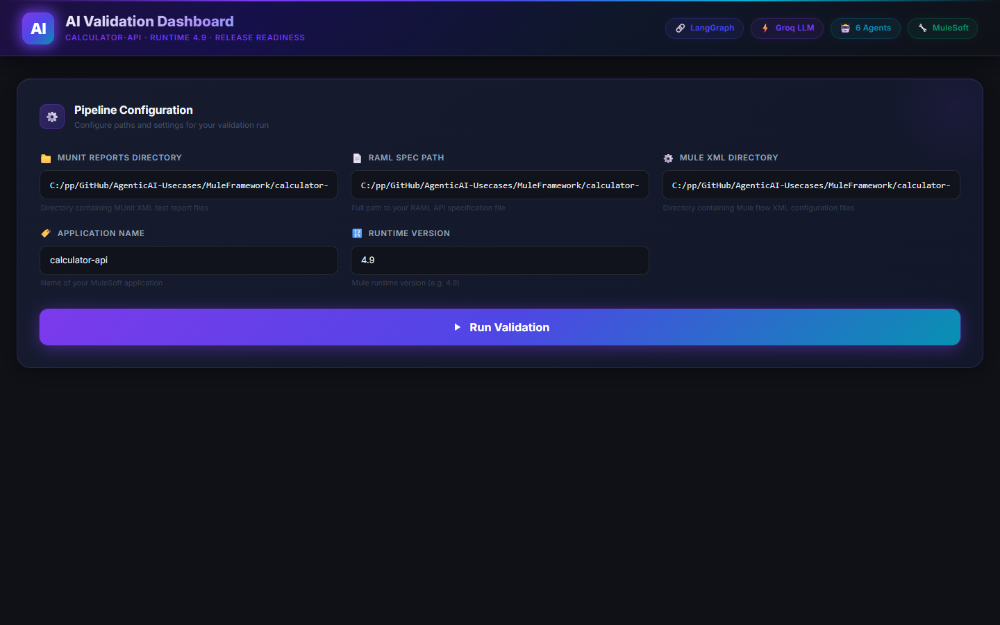
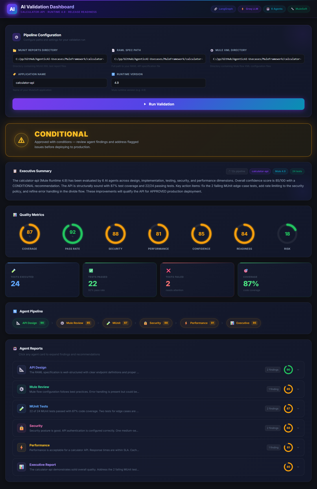
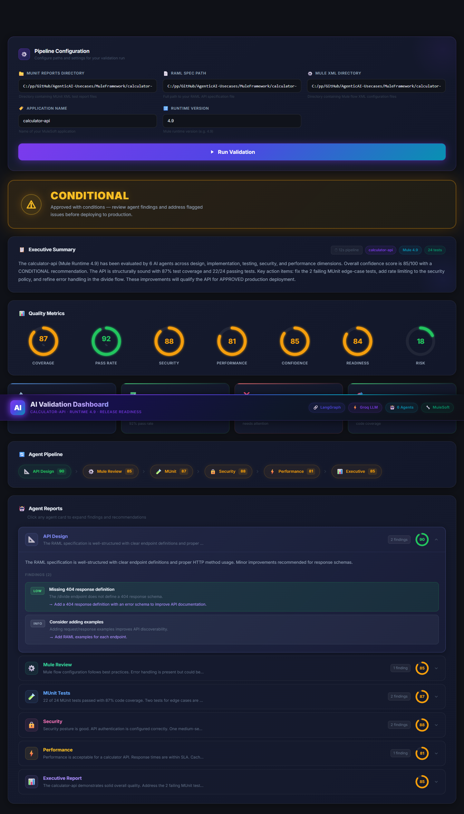

# AI Validation Dashboard — Complete Guide

A production-grade AI-powered quality gate for MuleSoft APIs. Six specialized LangGraph agents analyze your RAML specification, Mule flow XML, MUnit test reports, and more — delivering a scored recommendation (APPROVED / CONDITIONAL / BLOCKED) within seconds.

---

## Architecture Overview



---

## What It Does (Plain English)

You paste in the paths to your MuleSoft project files and click **Run Validation**. The system:

1. **Parses** your MUnit XML test reports to extract pass/fail counts and coverage percentages.
2. **Analyzes** your RAML API specification for design quality, completeness, and standards compliance.
3. **Reviews** your Mule flow XML for best-practice implementation, error handling, and configuration quality.
4. **Evaluates** your test coverage and identifies gaps or failing tests.
5. **Audits** security configuration — policies, authentication, input validation, and known vulnerability patterns.
6. **Profiles** performance characteristics — response time expectations, caching, and throughput limits.
7. **Synthesizes** all findings into an executive dashboard with a single actionable recommendation.

Each step is performed by a dedicated AI agent (powered by Groq's ultra-fast inference). The whole pipeline typically completes in 15–60 seconds depending on project size.

---

## Prerequisites

| Requirement | Version | Notes |
|------------|---------|-------|
| Python | 3.11+ | Backend runtime |
| Node.js | 18+ | Frontend runtime |
| npm | 9+ | Frontend package manager |
| Groq API key | — | Free tier available at [console.groq.com](https://console.groq.com) |
| MuleSoft project | — | With RAML spec, Mule XML, and MUnit reports |

---

## Step-by-Step Setup

### 1. Clone / Open the Repo

```bash
git clone <repo-url>
cd AgenticAI-Usecases/MuleFramework/calculator-api-ai-validation
```

Or simply open the folder if you already have it locally.

### 2. Start the Backend (FastAPI)

#### a. Create a virtual environment

```bash
cd ai-validation-service
python -m venv .venv

# Windows
.venv\Scripts\activate

# macOS / Linux
source .venv/bin/activate
```

#### b. Install Python dependencies

```bash
pip install -r requirements.txt
```

#### c. Configure environment variables

Create a `.env` file in the `ai-validation-service/` directory:

```env
GROQ_API_KEY=gsk_xxxxxxxxxxxxxxxxxxxxxxxxxxxxxxxxxxxx
```

**Getting a free Groq API key:**
1. Go to [console.groq.com](https://console.groq.com)
2. Sign up for a free account (no credit card required)
3. Navigate to **API Keys** → **Create API Key**
4. Copy the key and paste it into your `.env` file

#### d. Start the FastAPI server

```bash
uvicorn app.main:app --host 0.0.0.0 --port 8000 --reload
```

You should see output like:
```
INFO:     Uvicorn running on http://0.0.0.0:8000
INFO:     Application startup complete.
```

Verify it is healthy:
```bash
curl http://localhost:8000/health
# → {"status": "healthy"}
```

### 3. Start the Frontend (React)

In a new terminal:

```bash
cd dashboard-ui
npm install
npm run dev
```

Vite will print something like:
```
  VITE v5.x.x  ready in 800ms

  ➜  Local:   http://localhost:3000/
```

### 4. Open the Dashboard

Open your browser and navigate to:
```
http://localhost:3000
```

You will see the AI Validation Dashboard with the configuration panel pre-filled with example paths.

### 5. Run Your First Validation

1. Update the path fields to point to your MuleSoft project files (see Input Panel section below).
2. Click the **Run Validation** button.
3. Watch the animated loading state as all 6 agents process your API.
4. Review the results — recommendation banner, score rings, agent findings.

---

## Using the Dashboard

### Input Panel

The configuration panel has five fields:

| Field | Example | Description |
|-------|---------|-------------|
| **MUnit Reports Directory** | `C:/myproject/target/test-reports` | The directory containing MUnit XML report files (generated by `mvn test` or `mule test`) |
| **RAML Spec Path** | `C:/myproject/src/main/resources/api/my-api.raml` | Full path to your RAML 1.0 API specification file |
| **Mule XML Directory** | `C:/myproject/src/main/mule` | Directory containing your Mule flow XML configuration files |
| **Application Name** | `calculator-api` | The name of your MuleSoft application (used in reports) |
| **Runtime Version** | `4.9` | Your Mule runtime version (e.g. `4.6`, `4.7`, `4.9`) |

Click **Run Validation** to start the pipeline. The button is disabled while the pipeline is running.

### Reading the Results

#### Recommendation Banner

The large banner at the top of the results page shows one of three verdicts:

| Verdict | Meaning | What to do |
|---------|---------|-----------|
| **APPROVED** | All quality gates passed. Ready for production. | Deploy with confidence. |
| **CONDITIONAL** | Passed with caveats. Minor or medium issues found. | Review agent findings, fix flagged issues, re-run. |
| **BLOCKED** | Critical issues detected. Not safe for production. | Resolve all CRITICAL/HIGH findings before proceeding. |

#### Score Rings

Seven animated ring charts give you at-a-glance quality metrics:

| Ring | Description | Good threshold |
|------|-------------|---------------|
| **Coverage** | Percentage of code covered by MUnit tests | ≥ 80% |
| **Pass Rate** | Percentage of MUnit tests that passed | ≥ 95% |
| **Security** | Security audit score from the security agent | ≥ 85 |
| **Performance** | Performance analysis score | ≥ 80 |
| **Confidence** | Weighted composite confidence score | ≥ 85 |
| **Readiness** | Overall production readiness score | ≥ 80 |
| **Risk** | Risk score — lower is better | ≤ 25 |

Color coding: **green** (≥ 90), **amber** (≥ 75), **red** (< 75). The Risk ring inverts: green means low risk.

#### Agent Pipeline Bar

A horizontal row shows each agent with its individual score, color-coded the same way as the score rings. This gives a quick overview of which agents found the most issues.

#### Agent Reports Accordion

Each agent card can be expanded by clicking it. Inside you will find:

- **Summary** — a plain-English paragraph summarizing what the agent found.
- **Findings** — individual issues with severity badges:

| Badge | Color | Meaning |
|-------|-------|---------|
| INFO | Slate | Informational — no action required |
| LOW | Green | Minor improvement opportunity |
| MEDIUM | Amber | Should be addressed before production |
| HIGH | Orange | Must be addressed — high impact |
| CRITICAL | Red | Blocking issue — must be resolved immediately |

Each finding includes:
- A **title** describing the issue
- **Detail** text explaining the root cause
- A **Recommendation** (shown in purple) with a specific action to take

---

## API Reference

### POST /validate

Runs the full 6-agent validation pipeline.

**Request Body:**
```json
{
  "munit_reports_dir": "/path/to/munit/xml/reports",
  "raml_path": "/path/to/api.raml",
  "mule_xml_dir": "/path/to/mule/flows",
  "application": "my-api-name",
  "runtime": "4.9"
}
```

**Response Body (200 OK):**
```json
{
  "dashboard": {
    "application": "my-api-name",
    "runtime": "4.9",
    "coverage": 87,
    "testsExecuted": 24,
    "testsPassed": 22,
    "testsFailed": 2,
    "passRate": 92,
    "securityScore": 88,
    "performanceScore": 81,
    "confidenceScore": 85,
    "riskScore": 18,
    "productionReadiness": 84,
    "recommendation": "CONDITIONAL"
  },
  "agent_reports": [
    {
      "agent": "api_design",
      "score": 90,
      "summary": "...",
      "findings": [
        {
          "severity": "medium",
          "title": "Missing 404 response schema",
          "detail": "The /divide endpoint does not define a 404 response.",
          "recommendation": "Add a 404 response schema to the RAML spec."
        }
      ],
      "raw_llm_output": null
    }
  ],
  "executive_summary": "Plain-English paragraph summarizing all findings...",
  "artifacts": {
    "munit_total": 24,
    "munit_failures": 2,
    "munit_coverage": 87
  }
}
```

**Error Response (422 Unprocessable Entity):**
```json
{
  "detail": [
    { "loc": ["body", "raml_path"], "msg": "field required", "type": "value_error.missing" }
  ]
}
```

---

### GET /health

Returns service health status.

```bash
curl http://localhost:8000/health
```
```json
{"status": "healthy"}
```

---

### GET /ready

Returns service readiness (checks LLM connectivity).

```bash
curl http://localhost:8000/ready
```
```json
{"status": "ready", "llm": "groq"}
```

---

## Screenshots

### Empty Dashboard (on load)



### Results Dashboard (after validation)



### Agent Findings (expanded card)



---

## Troubleshooting

### CORS errors in the browser console

The Vite dev server proxies `/api` requests to `http://localhost:8000`, so CORS should not be an issue in development. If you see CORS errors, make sure:
- The backend is running on port 8000.
- You are accessing the dashboard through `http://localhost:3000` (not via a file:// URL or a different port).

### "Network error — is the backend running on :8000?"

The frontend cannot reach the backend. Check:
1. The FastAPI server is running: `curl http://localhost:8000/health`
2. The Vite proxy config in `vite.config.ts` points to `http://localhost:8000`.
3. No firewall is blocking port 8000.

### "Server error 500"

The backend encountered an error. Check the FastAPI terminal for the Python traceback. Common causes:
- A file path in the request body does not exist on disk.
- The MUnit reports directory is empty or contains no XML files.

### Groq API key invalid / 401 Unauthorized

- Verify your `GROQ_API_KEY` in `ai-validation-service/.env` is correct.
- Check the key has not expired at [console.groq.com](https://console.groq.com).
- Ensure the `.env` file is in the `ai-validation-service/` directory, not the project root.

### MUnit path not found

The `munit_reports_dir` path must be an absolute path to a directory that:
- Exists on the machine running the **backend** (not the browser machine).
- Contains at least one `.xml` file produced by MUnit.

If you are running the backend on a remote server, the paths must be valid on that server.

### Vite fails to start / port 3000 already in use

Kill the existing process and restart:
```bash
# Windows
npx kill-port 3000
npm run dev

# macOS / Linux
lsof -ti:3000 | xargs kill -9
npm run dev
```

### Frontend shows blank page after changes

Clear the Vite cache and restart:
```bash
rm -rf node_modules/.vite
npm run dev -- --force
```
