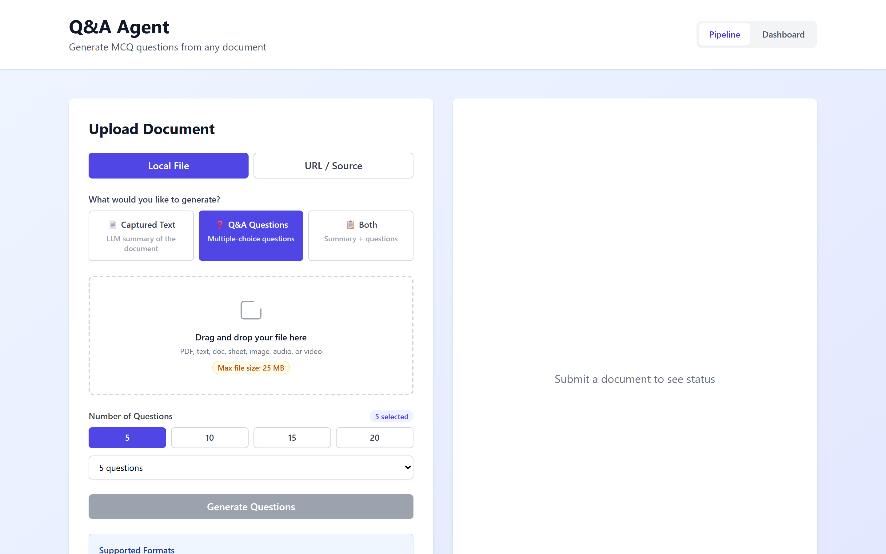
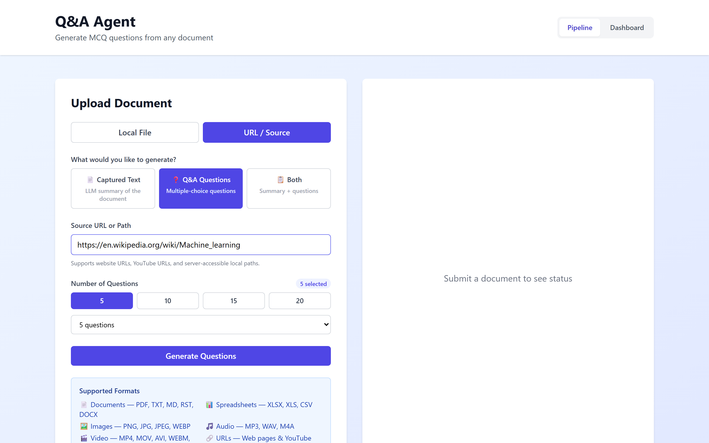
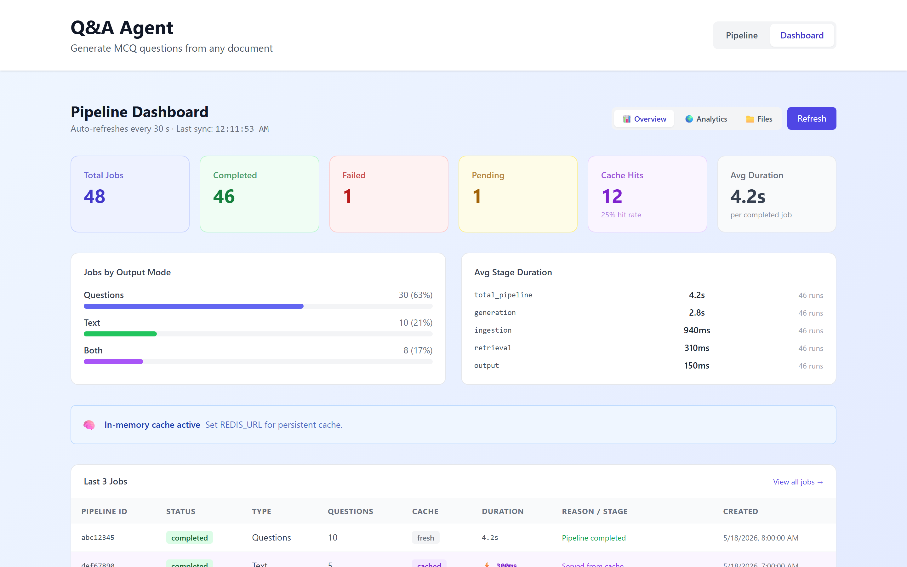
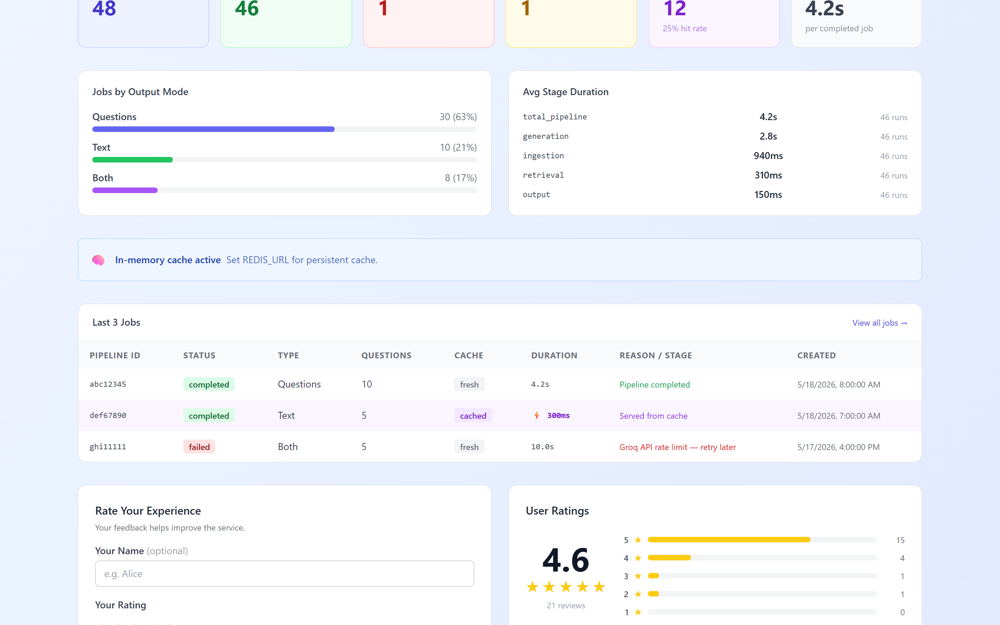
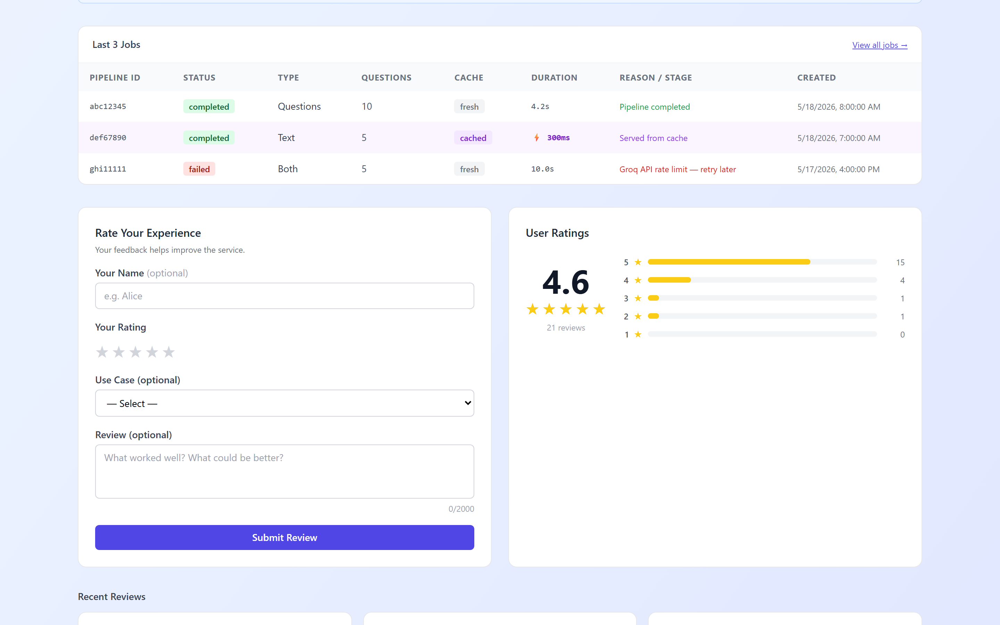
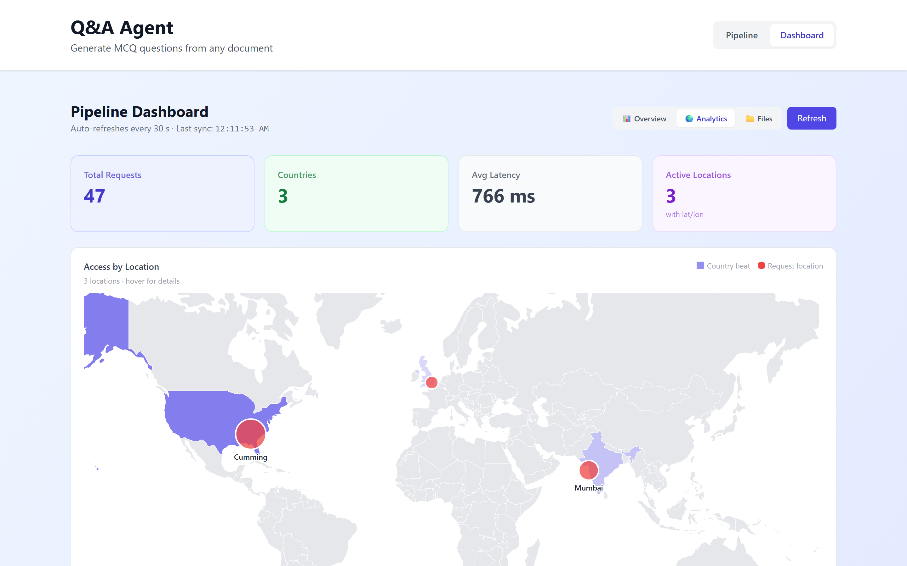
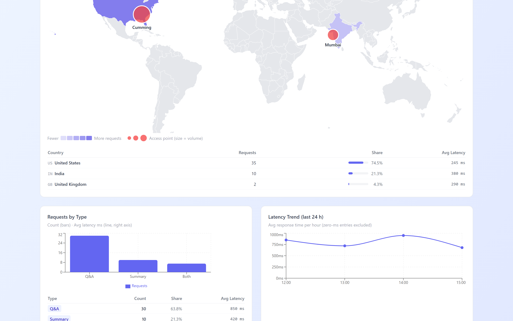
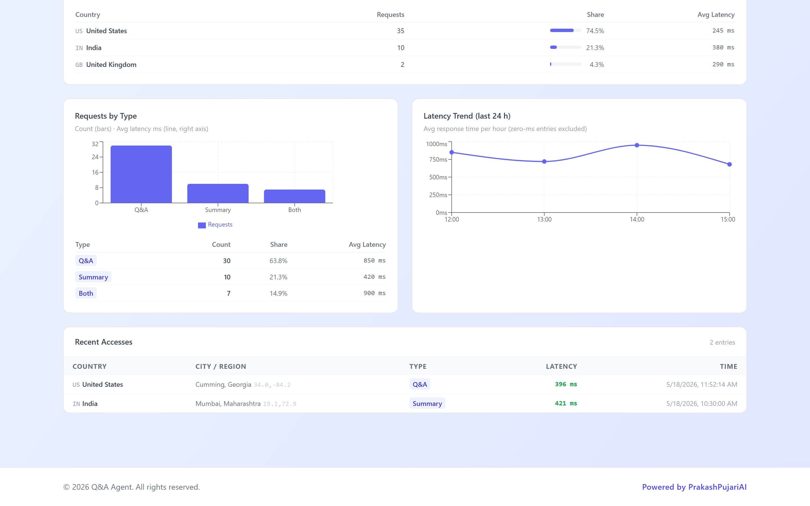
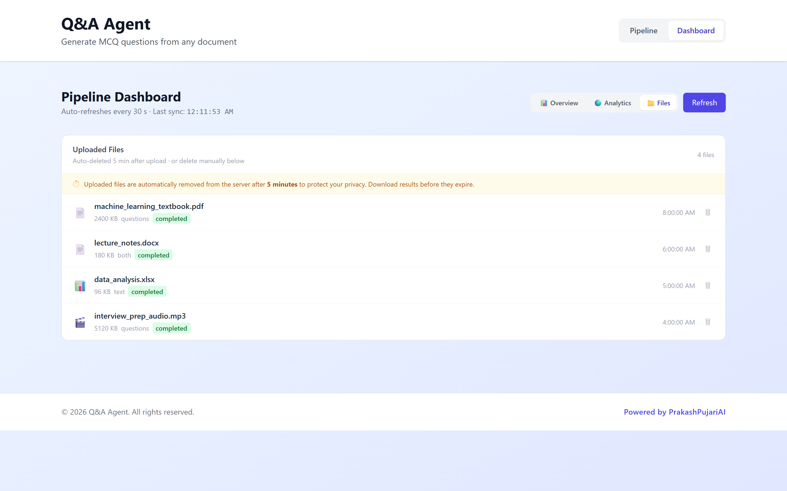
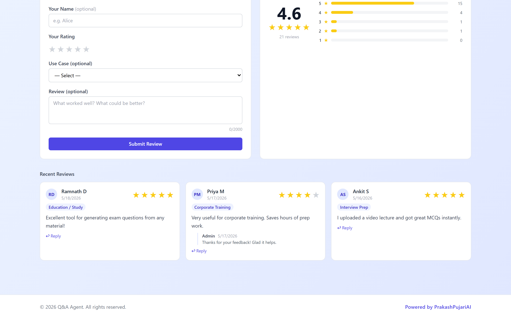

# Q&A Agent — User Guide

> **Generate multiple-choice questions and summaries from any document, URL, or media file — powered by AI.**

Live app: **https://frontend-six-red-29.vercel.app**

---

## Table of Contents

1. [What Does This App Do?](#1-what-does-this-app-do)
2. [Supported Input Formats](#2-supported-input-formats)
3. [Upload a File](#3-upload-a-file)
4. [Use a URL or YouTube Link](#4-use-a-url-or-youtube-link)
5. [Choose Output Mode](#5-choose-output-mode)
6. [Set Number of Questions](#6-set-number-of-questions)
7. [Track Job Status](#7-track-job-status)
8. [View & Download Results](#8-view--download-results)
9. [Dashboard Overview](#9-dashboard-overview)
10. [Analytics & Geographic Map](#10-analytics--geographic-map)
11. [Files Manager](#11-files-manager)
12. [Reviews & Ratings](#12-reviews--ratings)
13. [Limits & Tips](#13-limits--tips)
14. [Architecture (for developers)](#14-architecture-for-developers)

---

## 1. What Does This App Do?

Q&A Agent takes **any document, webpage, audio, or video** and uses AI to generate:

| Output | Description |
|--------|-------------|
| **MCQ Questions** | Multiple-choice questions with 4 options and a correct answer + explanation |
| **Summary** | Clean, structured Markdown summary (Overview / Key Topics / Key Facts / Takeaways) |
| **Both** | MCQ questions + summary combined in one run |

**Example use cases:**
- 📚 Students: upload a PDF textbook chapter → get 10 exam-style questions instantly
- 🎓 Teachers: paste a Wikipedia URL → create a quiz in seconds
- 🏢 Trainers: upload a training video → generate comprehension questions
- 🔬 Researchers: drop in a paper → get a structured summary
- 🎵 Podcasters: upload an MP3 interview → transcribe + summarize

---

## 2. Supported Input Formats

### 📄 Documents
| Format | Extension | Notes |
|--------|-----------|-------|
| PDF | `.pdf` | Text-based PDFs; scanned images use AI OCR |
| Word | `.docx` | Full paragraph extraction |
| Text | `.txt` `.md` `.rst` | Plain text, Markdown, reStructuredText |
| Spreadsheet | `.xlsx` `.xls` `.csv` | All sheets extracted |

### 🖼️ Images
| Format | Notes |
|--------|-------|
| `.png` `.jpg` `.jpeg` `.webp` | AI vision model extracts all visible text and content |

### 🎵 Audio
| Format | Notes |
|--------|-------|
| `.mp3` `.wav` `.m4a` | Groq Whisper transcription (~10–30 s) |

### 🎬 Video
| Format | Notes |
|--------|-------|
| `.mp4` `.webm` | Groq Whisper transcription |
| `.mov` `.avi` `.mkv` | Requires ffmpeg on server; convert to MP4 if unavailable |

### 🌐 URLs
| Type | Notes |
|------|-------|
| Web pages | Any HTTP/HTTPS URL — Wikipedia, news articles, documentation |
| YouTube | Auto-extracts transcript via 4-layer fallback |

---

## 3. Upload a File

### Step 1 — Open the Pipeline tab

The app opens on the **Pipeline** tab with the file uploader ready.


The left panel is the input area. The right panel shows job status and results once submitted.

### Step 2 — Select the Local File tab

Click **Local File** (active by default) to reveal the drag-and-drop zone.



- Drag your file onto the drop zone, or click it to open a file picker
- Supported: PDF, TXT, MD, RST, DOCX, XLSX, XLS, CSV, PNG, JPG, JPEG, WEBP, MP3, WAV, M4A, MP4, MOV, AVI, WEBM, MKV
- Maximum file size: **25 MB**

### Step 3 — Choose output mode and question count, then submit

Select **Q&A Questions**, **Captured Text**, or **Both**, adjust the question count slider, and click **Generate Questions**.

---

## 4. Use a URL or YouTube Link

Click the **URL / Source** tab to switch to URL input.


**What to paste:**
- Any web page: `https://en.wikipedia.org/wiki/Machine_learning`
- A YouTube video: `https://www.youtube.com/watch?v=...`
- A YouTube playlist item works too — the app extracts just the video ID



**How YouTube transcripts are fetched (4-layer fallback):**

| Layer | Method | Works on Render cloud? |
|-------|--------|------------------------|
| 0 | Supadata.ai API (set `SUPADATA_API_KEY`) | ✅ Yes |
| 1 | youtube-transcript-api | ❌ Blocked on cloud IPs |
| 2 | Cookies-based session | ✅ If `YOUTUBE_COOKIES` set |
| 3 | yt-dlp VTT subtitles | ⚠️ Sometimes |
| 4 | yt-dlp audio + Groq Whisper | ✅ Always (30 s) |

> **Tip:** For fastest, most reliable YouTube support on cloud servers, sign up free at [supadata.ai](https://supadata.ai) (10,000 requests/month free) and add `SUPADATA_API_KEY` to Render environment variables.

---

## 5. Choose Output Mode

Three output modes appear below the input tabs:

| Mode | Icon | What you get |
|------|------|-------------|
| **Captured Text** | 📄 | Structured Markdown summary (Overview, Key Topics, Key Facts, Takeaways) |
| **Q&A Questions** | ❓ | Multiple-choice questions with choices A–D, correct answer, and explanation |
| **Both** | 📋 | Summary + questions combined in one document |

---

## 6. Set Number of Questions

When **Q&A Questions** or **Both** mode is selected, the question count control appears:


- **Quick-pick buttons**: 5 / 10 / 15 / 20 questions
- **Dropdown**: fine-tune to any value from 1 to 20
- The current selection is shown as a badge ("5 selected")

> **Note:** For large documents (1,000+ pages), requesting more questions (e.g. 20) improves coverage across the full document because the map-reduce pipeline samples more sections.

---

## 7. Track Job Status

After clicking **Generate Questions**, the right panel immediately updates:

| Status | Meaning |
|--------|---------|
| **queued** | Waiting in queue — shows position ("2 jobs ahead") |
| **processing** | AI pipeline is running — shows elapsed seconds |
| **completed** | Results ready — download buttons appear |
| **failed** | Error occurred — message describes what went wrong |

The status panel auto-refreshes every 2 seconds. For large documents the processing stage shows:
```
Processing your document…
45s elapsed — large documents may take 1–2 minutes
```

---

## 8. View & Download Results

When a job completes, the right panel shows a Markdown preview and two download buttons:

- **📥 Download PDF** — saves a styled PDF to your device
- **👁️ View PDF** — opens the PDF in a new browser tab

The Markdown preview shows the first 500 characters of the output. The full content is in the downloaded file.

---

## 9. Dashboard Overview

Click **Dashboard** in the top-right navigation to open the analytics dashboard.



### KPI Cards (top row)

| Card | What it shows |
|------|--------------|
| **Total Jobs** | All submitted jobs (lifetime) |
| **Completed** | Successfully finished jobs |
| **Failed** | Jobs that errored |
| **Pending** | Jobs currently queued or processing |
| **Cache Hits** | Jobs served from cache (skipped full pipeline) |
| **Avg Duration** | Mean pipeline time across completed jobs |

### Jobs by Output Mode & Stage Timings



- **Jobs by Output Mode** bar chart shows the split between Questions / Text / Both
- **Avg Stage Duration** table breaks down where time is spent (ingestion, generation, output)

### Recent Jobs Table



Each row shows:
- **Pipeline ID** — unique job identifier
- **Status** badge — completed (green) / failed (red) / cached (purple)
- **Type** — Q&A Questions / Text / Both
- **Questions** — how many MCQs were requested
- **Cache** — `fresh` (full pipeline ran) or `cached` (result served from Redis)
- **Duration** — total wall-clock time
- **Reason / Stage** — human-readable outcome (e.g. "Pipeline completed", "Served from cache")
- **Created** — submission timestamp

---

## 10. Analytics & Geographic Map

Click **Analytics** in the Dashboard tab bar.



The top KPI cards show **Total Requests**, **Countries**, **Avg Latency**, and **Active Locations**.

The world map shows:
- **Country heat map** (blue fill) — darker = more requests from that country
- **Red circles** — exact city-level access points (circle size = request volume)
- Hover over a circle to see city, country, request count, and average latency

### Country Breakdown & Charts



- **Country table** — requests per country with percentage share and average latency
- **Requests by Type** bar chart — Q&A vs Summary vs Both with per-type latency
- **Latency Trend** line chart — average response time per hour over the last 24 hours

### Recent Accesses Table



Shows the last individual requests with:
- Country flag + name
- City / Region
- Request type (Q&A / Summary / Both) with colour coding
- Latency in milliseconds (green = fast, red = slow)
- Exact timestamp

---

## 11. Files Manager

Click **Files** in the Dashboard tab bar.



### What you see

| Column | Description |
|--------|-------------|
| File icon | 📄 document, 🖼️ image, 🎬 media, 📊 spreadsheet |
| Filename | Original uploaded filename |
| Size | File size in KB or MB |
| Output mode badge | questions / both / text |
| Status badge | completed / failed |
| Time | Upload time |
| 🗑 | Delete button — removes file immediately |

### Auto-Deletion (Privacy Policy)

> **Uploaded files are automatically removed after 5 minutes.**

The amber banner at the top of the Files section reminds you. The deletion is two-layer:

1. **Immediate** — the raw file is deleted from disk as soon as the pipeline finishes extracting its text
2. **Background sweeper** — runs every 60 seconds, removes any leftover files older than 5 minutes

**Download your results before the timer expires.** The generated Markdown and PDF are kept in the job record — only the raw upload is deleted.

To change the expiry window, set `FILE_EXPIRY_SECONDS` on the server (default: `300`).

---

## 12. Reviews & Ratings

At the bottom of the **Overview** tab, leave feedback or read what others say.



### Leave a Review

1. Enter your name (optional — shown as initials avatar if omitted)
2. Click 1–5 stars to set your rating
3. Select a use case from the dropdown (Education, Corporate Training, Interview Prep, etc.)
4. Write an optional review (up to 2,000 characters)
5. Click **Submit Review**

### View Reviews

Review cards show:
- Reviewer name with coloured initials avatar
- Star rating (★★★★★)
- Use case tag
- Review text
- Admin replies (indented with a blue left border)
- Submission date

The **User Ratings** panel on the right shows the aggregate score and star distribution histogram.

---

## 13. Limits & Tips

| Limit | Value |
|-------|-------|
| Max file size | **25 MB** |
| Max questions | **20** |
| Min questions | **1** |
| Rate limit | **10 requests/hour** per user |
| Spike limit | **3 requests/sec** |
| File retention | **5 minutes** (auto-deleted after pipeline completes) |
| Single-pass doc size | **≤ 20,000 chars** (~10 pages) — full text in one LLM call |
| Map-reduce doc size | **Unlimited** — larger docs split into 20K-char chunks, processed in parallel |

### Processing time by document size

| Document size | Pages | Mode | Typical time |
|--------------|-------|------|-------------|
| < 20K chars | < 10 pages | Single-pass (100% coverage) | 3–8 s |
| 20K–200K chars | 10–100 pages | Map-reduce, all chunks | 15–40 s |
| 200K–2M chars | 100–1 000 pages | Map-reduce, sampled chunks | 40–90 s |

### Tips for best results

- ✅ Use text-based PDFs (not scanned images) for fastest processing
- ✅ For audio/video, 1–5 minute clips produce the best questions
- ✅ Wikipedia URLs work very well — paste the topic URL directly
- ✅ For spreadsheets, put the most important data in the first rows
- ✅ Request 20 questions for long documents to maximise coverage
- ⚠️ YouTube on cloud servers needs `SUPADATA_API_KEY` for fastest results (see Section 4)
- ⚠️ MOV/AVI/MKV require ffmpeg on the server — convert to MP4 if unavailable
- ⚠️ If the AI is temporarily unavailable, wait 60 seconds and retry (Groq quota resets per minute)

---

## 14. Architecture (for developers)

### System Overview

```
┌─────────────────────────────────────────────────────────────────┐
│  USER BROWSER (React + Vite → Vercel)                           │
│                                                                  │
│  ┌───────────────────┐    ┌──────────────────────────────────┐  │
│  │  DocumentUpload   │    │  JobStatus (polls /api/status)   │  │
│  │  • File / URL /   │    │  • queued → processing →         │  │
│  │    YouTube input  │    │    completed / failed            │  │
│  │  • 20 formats     │    │  • elapsed time display          │  │
│  │  • 1–20 questions │    │  • Download MD / PDF             │  │
│  └────────┬──────────┘    └──────────────────────────────────┘  │
│           │ POST /api/qa/generate                                │
└───────────┼─────────────────────────────────────────────────────┘
            ▼ (Vercel proxy → Render)
┌─────────────────────────────────────────────────────────────────┐
│  FASTAPI (Python 3.12 → Render free tier)                       │
│                                                                  │
│  WAF → Rate Limit → Spike Arrest → Validate                     │
│           │                                                      │
│           ▼                                                      │
│  Job Queue (in-process) → 2 parallel worker threads             │
│           │                                                      │
│  ┌──────────────────────────────────────────────────────────┐   │
│  │  LANGGRAPH PIPELINE (no vector DB / no embeddings)        │   │
│  │                                                           │   │
│  │  1. extract_text                                          │   │
│  │    ├── PDF (pypdf)                                        │   │
│  │    ├── DOCX / XLSX / XLS / CSV                           │   │
│  │    ├── Image (Groq Vision / Llama 4 Scout)               │   │
│  │    ├── Audio/Video (Groq Whisper)                        │   │
│  │    ├── MOV/AVI/MKV (ffmpeg → WAV → Whisper)              │   │
│  │    ├── URL (urllib → parse HTML)                         │   │
│  │    └── YouTube (4-layer transcript fallback)             │   │
│  │         │                                                  │   │
│  │  2. generate — map-reduce for large docs                  │   │
│  │    ├── docs ≤ 20K chars → single LLM call (100% coverage) │   │
│  │    └── docs  > 20K chars → split into 20K-char chunks:   │   │
│  │          TF-IDF diversity selection → ThreadPoolExecutor  │   │
│  │          (3 parallel LLM calls) → deduplicate → merge     │   │
│  │                                                           │   │
│  │  LLM fallback chain (6 levels):                          │   │
│  │    1. groq/llama-3.3-70b-versatile  (~600 ms)            │   │
│  │    2. groq/llama-3.1-8b-instant     (~150 ms)            │   │
│  │    3. groq/llama3-8b-8192           (~200 ms)            │   │
│  │    4. gemini-2.5-flash              (~800 ms)            │   │
│  │    5. huggingface/Kimi-K2           (2 000 ms+)          │   │
│  │         │                                                  │   │
│  │  3. format_output → Markdown + PDF                        │   │
│  └──────────────────────────────────────────────────────────┘   │
│           │                                                      │
│  PostgreSQL (Render)                                             │
│    ├── qa_jobs          (job status + results)                   │
│    ├── qa_stage_timings (per-stage latency)                      │
│    ├── qa_reviews       (user ratings + replies)                 │
│    ├── uploaded_files   (file metadata + TTL)                    │
│    └── access_logs      (IP + geo + latency per request)         │
│                                                                  │
│  Background threads                                              │
│    ├── 2 × job-worker     (parallel pipeline execution)          │
│    ├── file-sweeper       (deletes uploads > 5 min old)          │
│    └── stuck-job-sweeper  (marks orphaned jobs failed)           │
│                                                                  │
│  LangSmith → pipeline traces + span timings                      │
└─────────────────────────────────────────────────────────────────┘
```

### Key Design Decisions

| Decision | Choice | Reason |
|----------|--------|--------|
| **No vector DB** | Direct LLM context injection | RAG retrieves what's *similar to a query*; Q&A generation needs *full coverage*. Direct injection is better for this use case |
| **No embeddings** | Full text → LLM | Embeddings + FAISS only sent 3–13% of a large doc to the LLM. Direct injection gives 100% for small docs and evenly-sampled coverage for large |
| **Map-reduce for large docs** | Split → TF-IDF diversity select → parallel LLM → deduplicate | Covers the full document, not just the first pages; 3× faster than sequential |
| **TF-IDF diversity sampling** | Greedy farthest-point algorithm | Selects chunks that cover different topics rather than clustering around the most prominent subject |
| **Primary LLM** | Groq/llama-3.3-70b | Groq LPU = 10× faster than GPU serving; 400–900 ms vs 1 500–3 000 ms on Gemini |
| **5-provider fallback** | Groq × 3 → Gemini → HF | Each Groq model has an independent quota; switching instantly avoids long waits |
| **`_SINGLE_PASS_CHARS = 20K`** | Matches Groq 6K TPM ≈ 24K chars | Prevents 413 "Request too large" errors on Groq free tier for any call size |
| **DB** | PostgreSQL + SQLite fallback | Persistent analytics across Render restarts |
| **2 worker threads** | `WORKER_COUNT=2` | Parallel job processing on Render free tier (512 MB RAM) |

### Pipeline Data Flow

```
  Input (file / URL / YouTube)
       │
       ▼  extract_text  (~500 ms – 2 s depending on format)
  clean_text  (plain UTF-8 string, unlimited size)
       │
       ├─ if len ≤ 20 000 chars (~10 pages)
       │       │
       │       ▼  SINGLE-PASS (100% coverage, 1 LLM call)
       │  LLM(full text) → result
       │
       └─ if len > 20 000 chars (10+ pages)
               │
               ▼  SPLIT into 20 000-char overlapping chunks
               │
               ▼  TF-IDF DIVERSITY SELECTION
               │   ├── Q&A: up to 20 topic-diverse chunks
               │   └── Summary: up to 30 topic-diverse chunks
               │
               ▼  PARALLEL LLM CALLS (ThreadPoolExecutor, 3 workers)
               │   ├── chunk 1 → questions/summary
               │   ├── chunk 2 → questions/summary
               │   └── chunk N → questions/summary
               │
               ▼  DEDUPLICATE (Jaccard similarity, threshold 0.65)
               │
               ▼  MERGE + RENUMBER / SYNTHESISE
               │
       ▼  format_output  (~100 ms)
  Markdown + PDF  →  stored in PostgreSQL  →  returned to browser
```

### CI/CD Pipeline

```
git push → GitHub (main branch)
  ├── Render auto-deploy hook  →  backend redeploy (~3 min)
  └── Vercel Git integration   →  frontend redeploy (~45 s)
```

Both deploy automatically on every push to `main`. No manual steps required.

### Environment Variables (Render)

| Variable | Required | Description |
|----------|----------|-------------|
| `GROQ_API_KEY` | ✅ | Primary LLM + Whisper transcription |
| `GEMINI_API_KEY` | Recommended | Fallback LLM (get from aistudio.google.com) |
| `HF_API_KEY` | Optional | Last-resort LLM fallback |
| `SUPADATA_API_KEY` | Recommended | YouTube transcript on cloud IPs |
| `DATABASE_URL` | ✅ | PostgreSQL connection string |
| `REDIS_URL` | Optional | Response cache + rate limiting |
| `LANGCHAIN_API_KEY` | Optional | LangSmith tracing |
| `FILE_EXPIRY_SECONDS` | Optional | Upload auto-delete window (default: 300) |
| `WORKER_COUNT` | Optional | Parallel job workers (default: 2) |
| `MAX_PARALLEL_CHUNKS` | Optional | Parallel LLM calls per job (default: 3) |
