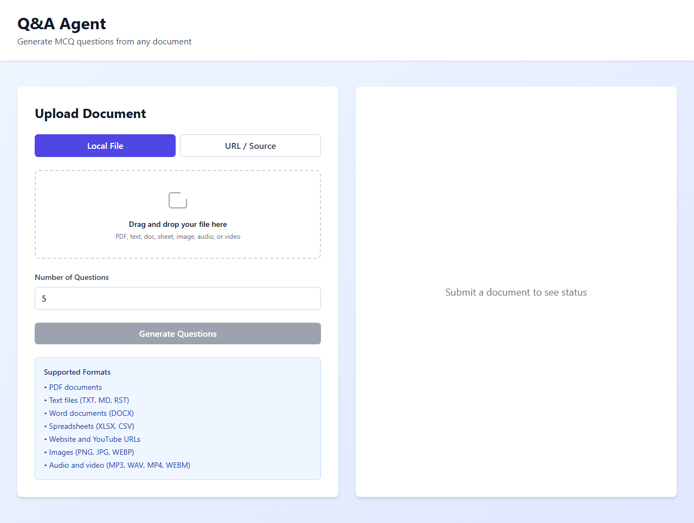
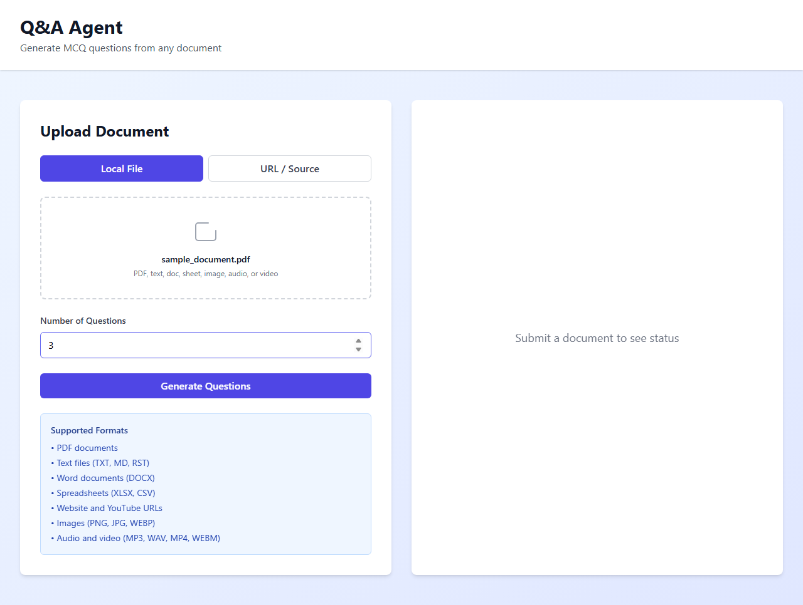
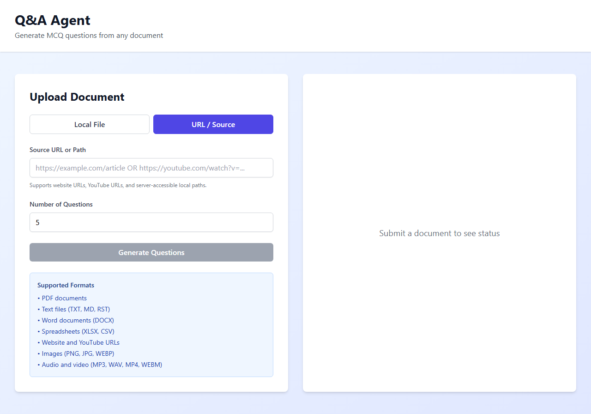
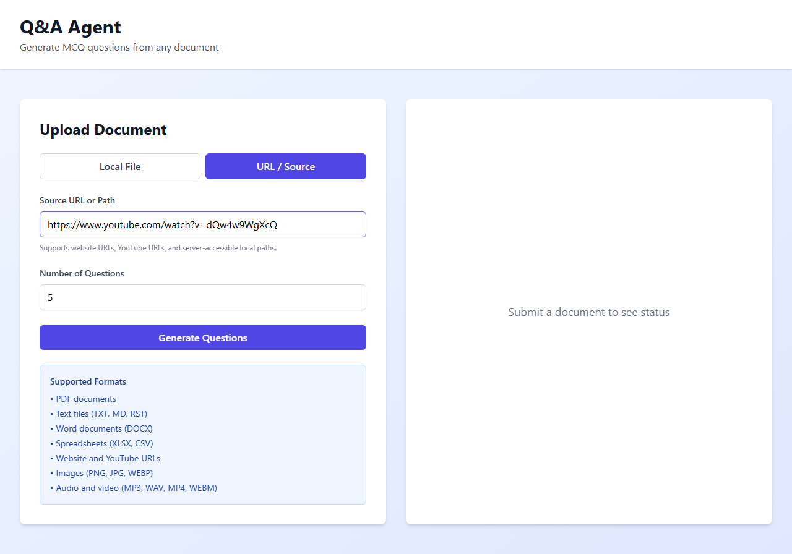
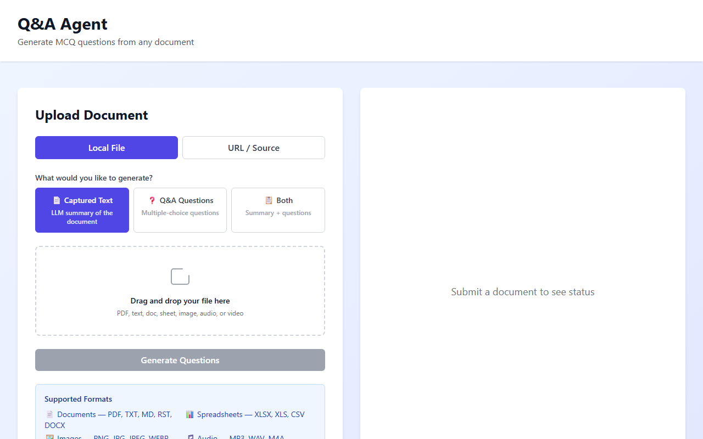
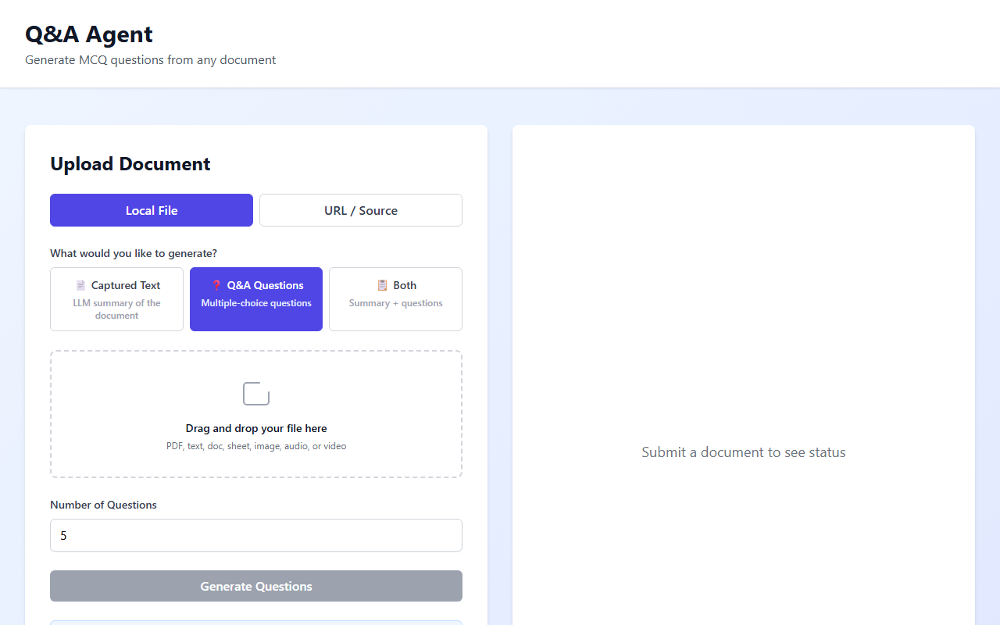
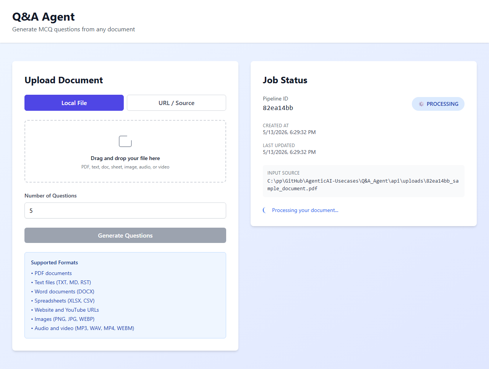
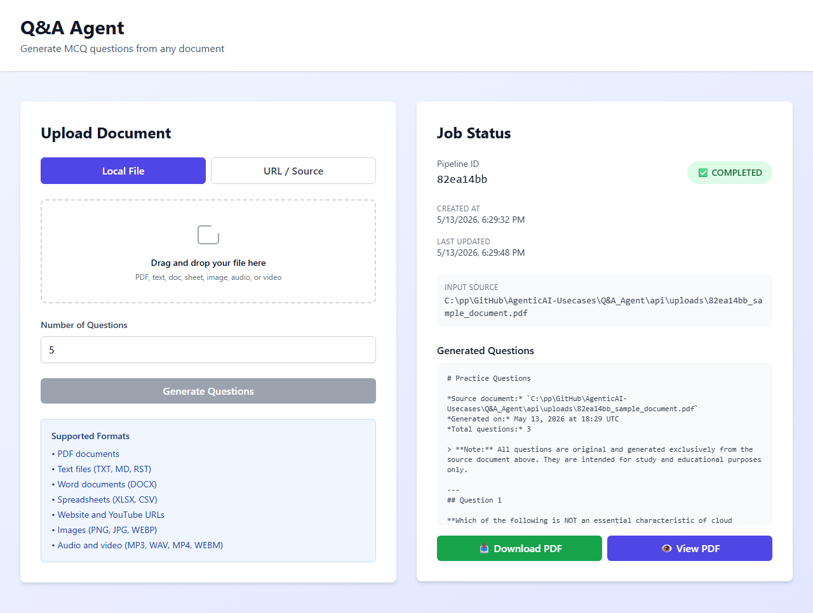

# Q&A Agent — User Guide

> **Generate multiple-choice questions and summaries from any document, URL, or media file — powered by AI.**

Live app: **https://frontend-six-red-29.vercel.app**

---

## Table of Contents

1. [What Does This App Do?](#1-what-does-this-app-do)
2. [Supported Input Formats](#2-supported-input-formats)
3. [Step-by-Step: Upload a File](#3-step-by-step-upload-a-file)
4. [Step-by-Step: Use a URL or YouTube Link](#4-step-by-step-use-a-url-or-youtube-link)
5. [Choosing Output Mode](#5-choosing-output-mode)
6. [Setting Number of Questions](#6-setting-number-of-questions)
7. [Tracking Job Status](#7-tracking-job-status)
8. [Viewing & Downloading Results](#8-viewing--downloading-results)
9. [Dashboard Overview](#9-dashboard-overview)
10. [Analytics & Geographic Map](#10-analytics--geographic-map)
11. [Files Manager](#11-files-manager)
12. [Reviews & Ratings](#12-reviews--ratings)
13. [Limits & Tips](#13-limits--tips)
14. [Architecture (for developers)](#14-architecture-for-developers)

---

## 1. What Does This App Do?

Q&A Agent takes **any document, webpage, audio, or video** and generates:

| Output | Description |
|--------|-------------|
| **MCQ Questions** | Multiple-choice questions with 4 options and a correct answer |
| **Summary** | Clean, structured plain-text summary of the content |
| **Both** | MCQ questions + summary in one run |

**Example use cases:**
- 📚 Students: upload a PDF textbook chapter → get 10 exam-style questions
- 🎓 Teachers: paste a Wikipedia URL → create a quiz in seconds
- 🏢 Trainers: upload a training video → generate comprehension questions
- 🔬 Researchers: drop in a paper → get a structured summary
- 🎵 Podcasters: upload an MP3 interview → transcribe + summarize

---

## 2. Supported Input Formats

### 📄 Documents
| Format | Extension | Notes |
|--------|-----------|-------|
| PDF | `.pdf` | Text-based PDFs; scanned images use OCR |
| Word Document | `.docx` | Paragraphs and headings extracted |
| Plain Text | `.txt` | Any UTF-8 or Latin-1 text file |
| Markdown | `.md` | Headings and formatting preserved |
| ReStructuredText | `.rst` | Common in Python docs |

### 📊 Spreadsheets
| Format | Extension | Notes |
|--------|-----------|-------|
| Excel (modern) | `.xlsx` | All sheets extracted as text |
| Excel (legacy) | `.xls` | Excel 97–2003 format supported |
| CSV | `.csv` | Comma-separated values read as text |

### 🖼️ Images
| Format | Extension | Notes |
|--------|-----------|-------|
| PNG | `.png` | Text extracted via Groq Vision AI |
| JPG / JPEG | `.jpg` `.jpeg` | Diagrams, screenshots, photos |
| WebP | `.webp` | Modern web image format |

> **How image extraction works:** The image is sent to Groq's Vision API (Llama 4 Scout). The AI reads and describes all visible text, charts, and content.

### 🎵 Audio
| Format | Extension | Notes |
|--------|-----------|-------|
| MP3 | `.mp3` | Podcasts, lectures, interviews |
| WAV | `.wav` | Uncompressed audio |
| M4A | `.m4a` | Apple audio format |

> **How audio works:** Speech is transcribed using Groq Whisper (whisper-large-v3), then questions are generated from the transcript.

### 🎬 Video
| Format | Extension | Notes |
|--------|-----------|-------|
| MP4 | `.mp4` | Most common video format |
| WebM | `.webm` | Web-optimized video |
| MOV | `.mov` | Apple QuickTime — requires ffmpeg on server |
| AVI | `.avi` | Legacy Windows format — requires ffmpeg |
| MKV | `.mkv` | Matroska container — requires ffmpeg |

> **How video works:** The audio track is extracted (MP4/WebM natively; MOV/AVI/MKV via ffmpeg), then transcribed with Whisper. If ffmpeg is unavailable for MOV/AVI/MKV, convert to MP4 first.

### 🌐 URLs & YouTube
| Type | Example |
|------|---------|
| Web page | `https://en.wikipedia.org/wiki/Machine_learning` |
| YouTube video | `https://www.youtube.com/watch?v=...` |
| YouTube Shorts | `https://youtube.com/shorts/...` |

---

## 3. Step-by-Step: Upload a File

### Step 1 — Open the Pipeline tab



The app opens on the **Pipeline** tab. You'll see two panels:
- **Left**: where you configure and submit your input
- **Right**: where the job status and results appear

---

### Step 2 — Select the File tab


Click **"Upload File"** (the first tab in the input panel).

The drop zone shows all accepted file types. You can:
- **Drag and drop** a file onto the zone
- **Click** the zone to open the file browser

---

### Step 3 — Choose your file


After selecting a file:
- The filename and size appear below the drop zone
- A green checkmark confirms the file is accepted
- If the file is too large (>25 MB) or an unsupported format, an error message appears immediately

---

### Step 4 — Set options and submit



Before submitting:
1. **Output Mode**: choose Questions, Summary, or Both (see [Section 5](#5-choosing-output-mode))
2. **Number of questions**: pick 1–20 using the quick buttons or dropdown
3. Click **Generate** (blue button) to submit

---

## 4. Step-by-Step: Use a URL or YouTube Link

### Step 1 — Select the URL tab



Click **"URL / Source"** tab in the input panel.

---

### Step 2 — Paste your URL



Paste any of:
- A web page URL: `https://example.com/article`
- A Wikipedia link
- A YouTube video URL

The app automatically detects YouTube links and routes them through the YouTube transcript API.

---

### Step 3 — Submit

Set your output mode and question count, then click **Generate**.

> **Note on YouTube:** Cloud servers are often blocked from fetching YouTube transcripts directly. If you see a "transcript blocked" warning, a manual paste fallback appears — click the video link, copy the transcript from YouTube's "Show transcript" panel, and paste it in.

---

## 5. Choosing Output Mode



| Mode | What you get |
|------|-------------|
| **Questions** (default) | 1–20 MCQ questions, each with 4 options and a marked answer |
| **Summary** | A structured plain-text summary of the document |
| **Both** | Summary followed by MCQ questions in one response |

Click the mode buttons to switch. Your selection persists until you change it.

---

## 6. Setting Number of Questions



When **Questions** or **Both** mode is selected:

- **Quick buttons**: `5` · `10` · `15` · `20` — click to set instantly
- **Dropdown**: choose any value from **1 to 20**

> Fewer questions = faster response. More questions = broader coverage but may take 10–30 s for large documents.

---

## 7. Tracking Job Status

After submitting, the right panel shows real-time job status:

### Queued


Your job is waiting in the processing queue. The queue processes one job at a time.

---

### Processing


The pipeline is running through 5 stages:
1. **Ingestion** — load and extract text from your input
2. **Chunking** — split text into 1,000-char overlapping pieces
3. **Embedding** — convert chunks to 384-dim vectors (all-MiniLM-L6-v2)
4. **Retrieval** — FAISS similarity search to find the most relevant chunks
5. **Generation** — Groq LLM generates questions/summary from retrieved context

A spinning indicator and "Processing…" badge show the job is active.

---

### Completed


A green **"completed"** badge confirms the job finished. The results appear immediately below.

---

### Failed

A red **"failed"** badge appears with a reason (e.g., "Groq API rate limit — retry later"). Wait 60 seconds and re-submit. The app has a 6-level LLM fallback chain, so failures are rare.

---

## 8. Viewing & Downloading Results


Results are displayed as formatted **Markdown**:
- MCQs show the question, 4 lettered options, and the correct answer highlighted
- Summaries show structured paragraphs with headers

**Download options:**
- **Download Markdown** — saves a `.md` file you can open in any text editor or Notion
- **Download PDF** — generates a print-ready PDF with formatted questions

---

## 9. Dashboard Overview

Click the **Dashboard** tab in the top navigation.

### Stats Cards

The top row shows aggregate pipeline statistics:

| Card | Description |
|------|-------------|
| Total Jobs | All jobs submitted since the app launched |
| Completed | Successfully finished jobs |
| Failed | Failed jobs (usually API rate limits) |
| Pending | Jobs currently queued or processing |
| Cache Hits | Jobs served from cache (same document submitted before) |
| Avg Duration | Average pipeline completion time |

---

### Jobs by Output Mode

A bar chart showing the split between Questions / Summary / Both modes.

---

### Avg Stage Duration

Shows how long each pipeline stage takes on average:
- `generation` — LLM call (usually the longest: 1–4 s)
- `ingestion` — file loading and text extraction
- `retrieval` — FAISS vector search
- `output` — formatting results

---

### Recent Jobs Table

The last 3 submitted jobs with: Pipeline ID, Status, Type, Duration, Cache, and Reason.

Click **"View all jobs →"** to expand to all historical jobs. Click **"Show less"** to collapse.

---

### Cache Status Banner

Shows whether Redis cache is active or in-memory mode. Repeated submissions of the same document are served instantly from cache (shown as ⚡ in the jobs table).

---

## 10. Analytics & Geographic Map

Click **Analytics** in the Dashboard tab navigation.

### KPI Cards

| Metric | Description |
|--------|-------------|
| Total Requests | All API requests logged |
| Countries | Number of unique countries that have accessed the app |
| Avg Latency | Average response time for all requests |
| Active Locations | Number of city-level locations with lat/lon data |

---

### Access by Location (World Map)

The world map shows two layers:
- **Country heat map** (indigo fill): countries shaded by request volume
- **Red circles**: exact city-level access points sized by request count

**Hover** over any country or circle to see a tooltip with:
- Country / City / Region
- Total requests and % share
- Average response latency
- Q&A vs Summary vs Both breakdown

Below the map, a table lists the **Top 10 Countries** with request count, share percentage bar, and average latency.

> **Note:** Location pins appear only for new requests after deployment (requires lat/lon data from ip-api.com).

---

### Requests by Type Chart

Dual-axis chart:
- **Bars (left axis)**: request count per type (Q&A / Summary / Both)
- **Amber line (right axis)**: average latency in ms per type

The table below the chart shows exact values for count, share %, and avg latency.

---

### Latency Trend (last 24 h)

Line chart showing average response time per hour over the last 24 hours. Spikes indicate server load or LLM provider delays.

---

### Recent Accesses Table

Last 20 requests with:
- Country and city (with coordinates if available)
- Request type (Q&A / Summary / Both)
- Latency (colour-coded: green < 500 ms · yellow < 1 s · red > 1 s)
- Timestamp

---

## 11. Files Manager

Click **Files** in the Dashboard tab navigation.

Shows all files uploaded through the Pipeline:

| Column | Description |
|--------|-------------|
| Filename | Original uploaded filename with type icon (📄 doc, 🖼️ image, 🎬 media, 📊 sheet) |
| Size | File size in KB or MB |
| Output Mode | What was generated from this file |
| Status | Job outcome (completed / failed) |
| Expires | Live countdown timer (e.g. `4m 12s`) showing time until auto-deletion |
| Date | Upload time (HH:MM:SS) |
| 🗑 | Delete button — removes the file immediately |

### Automatic File Deletion (Privacy-First)

> **Uploaded files are automatically removed after 5 minutes.**

This is a deliberate privacy and storage feature, not a limitation:

- **Immediate deletion** — the raw file is deleted from disk as soon as the pipeline finishes extracting its text. Only the generated output (questions/summary) is kept.
- **Background sweeper** — a background task runs every 60 seconds and removes any leftover files older than 5 minutes (safety net for abandoned uploads or crashes).
- **Double safety net** — files that are still being processed are left alone; they are only swept after the job completes or after 10 minutes maximum.

**The live countdown badge** turns orange and pulses when less than 60 seconds remain.

```
┌───────────────────────────────────────────────────┐
│  📄 report.pdf   25 KB   questions   ✅  [4m 12s] │  ← amber badge
│  🖼️ diagram.png  1.2 MB  questions   ✅  [  45s] │  ← orange+pulse
│  🎬 lecture.mp4  80 MB  both        ✅  [expired]│  ← red badge
└───────────────────────────────────────────────────┘
```

### Manual Deletion

Click the **🗑** trash icon → confirm in the modal → file is deleted immediately (both from disk and the database record). The generated Markdown and PDF outputs for that run are also removed.

> **Tip:** Download your results before the 5-minute timer expires. The **Download** button is available in the job status card immediately after a run completes.

### Configuring the Expiry Window

The default is 5 minutes. To change it, set the `FILE_EXPIRY_SECONDS` environment variable on the server:

```
FILE_EXPIRY_SECONDS=600   # 10 minutes
FILE_EXPIRY_SECONDS=60    # 1 minute (aggressive cleanup)
FILE_EXPIRY_SECONDS=0     # keep files indefinitely (not recommended)
```

---

## 12. Reviews & Ratings

At the bottom of the **Overview** tab:

### Leave a Review

1. Enter your name (optional)
2. Click stars to set your rating (1–5)
3. Select a use case from the dropdown
4. Write an optional review
5. Click **Submit Review**

### View Reviews

Reviews appear as cards showing:
- Reviewer name and initials avatar
- Star rating
- Use case tag
- Review text
- Replies from the team (indented with a blue left border)

You can reply to any review by clicking **"↩ Reply"** and entering your text.

---

## 13. Limits & Tips

| Limit | Value |
|-------|-------|
| Max file size | **25 MB** |
| Max questions | **20** |
| Min questions | **1** |
| Rate limit | **10 requests/hour** per user |
| Spike limit | **3 requests/sec** |
| File retention | **5 minutes** (auto-deleted after pipeline completes or 5 min elapses) |
| Document size (single-pass) | **≤ 60 000 chars** (~30 pages) — full document sent in one LLM call |
| Document size (map-reduce) | **Unlimited** — 1 000+ page docs split into 20 000-char chunks, processed in parallel passes |

**Processing time by document size:**

| Document size | Pages | Mode | Q&A time | Summary time |
|--------------|-------|------|-----------|--------------|
| 10K–60K chars | 1–30 pages | Single-pass (100% coverage) | ~3–5 s | ~3–5 s |
| 60K–200K chars | 30–100 pages | Map-reduce (100% coverage) | ~30–40 s | ~35–45 s |
| 200K–500K chars | 100–250 pages | Map-reduce (80% coverage) | ~60 s | ~80 s |
| 500K–2M chars | 250–1 000 pages | Map-reduce (20–40% coverage, evenly sampled) | ~60 s | ~90 s |

> **Coverage note:** For 1 000+ page documents, the pipeline samples up to 20 chunks (Q&A) or 30 chunks (summary) evenly distributed across the full document — beginning, middle, and end — not just the first few pages. Every major section contributes to the output.

**Tips for best results:**
- ✅ Use text-based PDFs (not scanned images) for fastest processing
- ✅ For audio/video, 1–5 minute clips produce the best questions (longer = more questions possible)
- ✅ Wikipedia URLs work very well — paste the topic URL directly
- ✅ For spreadsheets, put important data in the first rows (top rows get most context weight)
- ✅ For 1 000+ page docs, request more questions (e.g. 20) to get broader document coverage
- ⚠️ YouTube transcripts may require manual paste on cloud servers (see Section 4)
- ⚠️ MOV/AVI/MKV video files require ffmpeg on the server; if unavailable, convert to MP4 first
- ⚠️ Very large documents (> 500K chars) may take 1–2 minutes — the job status page updates in real time

---

## 14. Architecture (for developers)

### System Overview

```
┌─────────────────────────────────────────────────────────────────┐
│  USER BROWSER (React + Vite → Vercel)                           │
│                                                                  │
│  ┌───────────────────┐    ┌──────────────────────────────────┐  │
│  │  DocumentUpload   │    │  JobStatus (polls /api/status)   │  │
│  │  • File / URL /   │    │  • queued → processing →         │  │
│  │    YouTube input  │    │    completed / failed            │  │
│  │  • 20 formats     │    │  • Markdown preview              │  │
│  │  • 1–20 questions │    │  • Download MD / PDF             │  │
│  └────────┬──────────┘    └──────────────────────────────────┘  │
│           │ POST /api/qa/generate                                │
└───────────┼─────────────────────────────────────────────────────┘
            ▼ (Vercel proxy → Render)
┌─────────────────────────────────────────────────────────────────┐
│  FASTAPI (Python 3.12 → Render free tier)                       │
│                                                                  │
│  WAF → Rate Limit → Spike Arrest → Validate                     │
│           │                                                      │
│           ▼                                                      │
│  ┌──────────────────────────────────────────────────────────┐   │
│  │  LANGGRAPH PIPELINE (3 stages, no vector DB needed)       │   │
│  │                                                           │   │
│  │  1. extract_text                                          │   │
│  │    ├── PDF (pypdf)                                        │   │
│  │    ├── DOCX (python-docx)                                 │   │
│  │    ├── XLSX/XLS (openpyxl/xlrd)                          │   │
│  │    ├── Image (Groq Vision/Llama 4 Scout)                  │   │
│  │    ├── Audio/MP4/WebM (Groq Whisper)                      │   │
│  │    ├── MOV/AVI/MKV (ffmpeg → WAV → Whisper)               │   │
│  │    ├── URL (urllib → infer format → load)                 │   │
│  │    └── YouTube (4-layer transcript fallback)              │   │
│  │         │                                                  │   │
│  │  2. generate (map-reduce for large docs, no embeddings)    │   │
│  │    ├── docs ≤ 60K chars → single LLM call (100% coverage) │   │
│  │    ├── docs  > 60K chars → split into 20K-char chunks:    │   │
│  │    │     map:    summarise/question each chunk             │   │
│  │    │     reduce: synthesise chunk outputs into final result│   │
│  │    │   samples up to 20 chunks (Q&A) / 30 (summary)       │   │
│  │    │   evenly distributed across the full document         │   │
│  │    ├── 1. groq/llama-3.3-70b-versatile  (~600ms/call)    │   │
│  │    ├── 2. groq/llama-3.1-8b-instant     (~150ms/call)    │   │
│  │    ├── 3. groq/gemma2-9b-it             (~350ms/call)    │   │
│  │    ├── 4. gemini-2.5-flash              (~800ms/call)    │   │
│  │    ├── 5. groq/llama-3.2-3b-preview     (~100ms/call)    │   │
│  │    └── 6. huggingface/Kimi-K2           (2000ms+/call)   │   │
│  │         │                                                  │   │
│  │  3. format_output → Markdown + PDF                        │   │
│  └──────────────────────────────────────────────────────────┘   │
│           │                                                      │
│  PostgreSQL (Render)                                             │
│    ├── qa_jobs          (job status + results)                   │
│    ├── qa_stage_timings (per-stage latency)                      │
│    ├── qa_reviews       (user ratings + replies)                 │
│    ├── uploaded_files   (file metadata)                          │
│    └── access_logs      (IP + geo + latency per request)         │
│                                                                  │
│  LangSmith → pipeline traces + span timings                      │
└─────────────────────────────────────────────────────────────────┘
```

### Key Design Decisions

| Decision | Choice | Reason |
|----------|--------|--------|
| **No vector DB** | Direct LLM context injection | RAG is only needed for a large static corpus across many documents. For single-document Q&A, direct full-text injection gives better coverage and 300–600 ms less latency |
| **No embeddings** | Full text → LLM | Embeddings + FAISS only sent 3–13% of a large doc to the LLM (via similarity search). Direct injection sends 100% for small docs and 20–40% (evenly distributed) for 1 000-page docs |
| **Map-reduce for large docs** | Split → map → reduce | Docs > 60 K chars are split into 20 K-char chunks. Questions/summaries are generated per chunk then synthesised. Covers the full document length without needing a massive context window |
| **Primary LLM** | Groq/llama-3.3-70b | Groq LPU = 10× faster than GPU serving; 400–900 ms vs 1500–3000 ms on Gemini |
| **6-provider fallback** | Groq × 4 → Gemini → HF | Each Groq model has an independent rate-limit quota; exhausting one falls to the next instantly |
| **DB** | PostgreSQL + SQLite fallback | Persistent analytics; SQLite for local dev |
| **Cache** | Redis + in-memory LRU | Repeated identical documents skip the full pipeline |
| **Deployment** | Render + Vercel free tier | $0/month for hobby/demo scale |

### Pipeline Data Flow

```
  Input (file / URL / YouTube)
       │
       ▼  extract_text  (~500ms–2s depending on format)
  clean_text  (plain UTF-8 string, unlimited size)
       │
       ├─ if len ≤ 60 000 chars (~30 pages)
       │       │
       │       ▼  SINGLE-PASS (100% coverage)
       │  LLM call with full text → result
       │
       └─ if len > 60 000 chars (30+ pages)
               │
               ▼  SPLIT into 20 000-char chunks (overlapping)
               │
               ▼  MAP: LLM call per sampled chunk
               │       ├── Q&A: up to 20 chunks, evenly spaced
               │       └── Summary: up to 30 chunks, evenly spaced
               │
               ▼  REDUCE: synthesise chunk outputs → final result
               │
       ▼  generate_questions / summarize  (~3s per chunk × N chunks)
  list[QuestionDict]  — JSON array from LLM
       │
       ▼  format_output  (~100ms)
  Markdown + PDF  →  stored in job record  →  returned to browser
```

**Coverage for large documents:**

| Doc size | Q&A chunks | Summary chunks | Coverage (evenly sampled) |
|---------|-----------|---------------|--------------------------|
| ≤ 30 pages | 1 (full) | 1 (full) | 100% |
| 30–100 pages | all chunks | all chunks | 100% |
| 100–250 pages | 20 of N | all chunks | 80%+ |
| 250–1 000+ pages | 20 of N | 30 of N | 20–40% (distributed) |

**Why no RAG / vector DB?**

RAG (Retrieve-Augment-Generate) adds an embedding + similarity search step to select
the "most relevant" chunks before sending them to the LLM. It is the right tool when:
- You have a large static corpus (e.g., a 10,000-page knowledge base)
- You want to answer questions *across* many documents

It is the *wrong* tool when:
- You process one document per job (this app's model)
- Your LLM already has a 128K token context window
- You want questions covering the *whole* document (RAG's retrieval misses content
  that doesn't match the query patterns)

Removing RAG saved ~500 MB of model weights (sentence-transformers) from the Render
container, eliminated 300–600 ms of per-job latency, and improved question quality
by giving the LLM full document coverage instead of 3–13%.

### CI/CD Pipeline

```
git push → GitHub Actions
  ├── trigger Render deploy hook (backend)
  └── vercel pull → vercel build → vercel deploy (frontend)
```

Both deploy in parallel. Backend deploy takes ~3 min (Python package install). Frontend deploy takes ~45 s.
