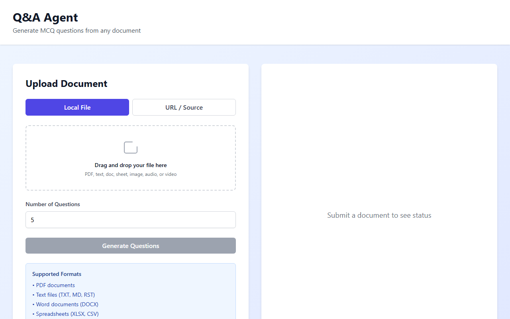
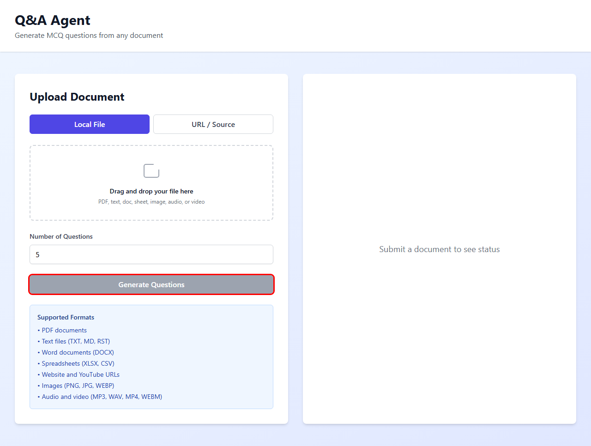
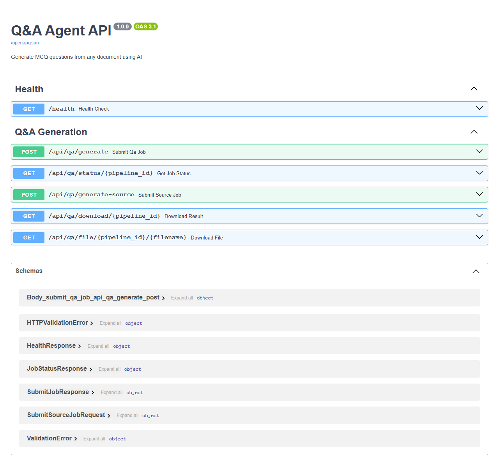

# Q&A Agent — Complete Application Guide

> **Generate multiple-choice practice questions from any document using AI.**
> Upload a PDF, paste a URL, or point at a YouTube video — the pipeline extracts
> the text, embeds it, retrieves relevant context, and asks GPT-4o to write
> original MCQ questions. Results are delivered as Markdown and a downloadable PDF.

---

## Table of Contents

1. [Architecture Overview](#1-architecture-overview)
2. [How to Start the App](#2-how-to-start-the-app)
3. [Step-by-Step UI Walkthrough](#3-step-by-step-ui-walkthrough)
   - [Step 1 — Landing Page](#step-1--landing-page)
   - [Step 2 — Choose Input Mode](#step-2--choose-input-mode)
   - [Step 3 — Local File Upload](#step-3--local-file-upload)
   - [Step 4 — URL / Source Input](#step-4--url--source-input)
   - [Step 5 — Set Number of Questions](#step-5--set-number-of-questions)
   - [Step 6 — Submit the Job](#step-6--submit-the-job)
   - [Step 7 — Queued & Processing States](#step-7--queued--processing-states)
   - [Step 8 — Completed: View Results](#step-8--completed-view-results)
   - [Step 9 — Download the PDF](#step-9--download-the-pdf)
   - [Step 10 — Empty Form Guard](#step-10--empty-form-guard)
4. [Backend Pipeline (7 Stages)](#4-backend-pipeline-7-stages)
5. [REST API Reference](#5-rest-api-reference)
6. [Supported Input Formats](#6-supported-input-formats)
7. [Configuration Reference](#7-configuration-reference)
8. [Project File Map](#8-project-file-map)

---

## 1. Architecture Overview

```
┌──────────────────────────────────────────────────────────────────────────┐
│                            USER BROWSER                                  │
│   React + Vite (port 5173)                                               │
│   ┌─────────────────────┐        ┌──────────────────────────────────┐   │
│   │  DocumentUpload.jsx  │        │         JobStatus.jsx            │   │
│   │  • File / URL input  │        │  • Polls status every 2 s       │   │
│   │  • Drag-and-drop     │        │  • Shows queued / processing /  │   │
│   │  • num_questions     │        │    completed / failed badges    │   │
│   │  • Submit button     │        │  • Markdown preview             │   │
│   └──────────┬───────────┘        │  • Download PDF / View PDF      │   │
│              │  POST /api/qa/…    └──────────────────────────────────┘   │
└──────────────┼──────────────────────────────────────────────────────────┘
               │ proxy
               ▼
┌──────────────────────────────────────────────────────────────────────────┐
│                         FASTAPI BACKEND  (port 8002)                     │
│                                                                          │
│   ┌──────────────┐    ┌────────────────────────┐    ┌────────────────┐  │
│   │  Rate Limiter│    │   Job Queue (FIFO)      │    │  SQLite DB     │  │
│   │  (slowapi)   │    │   single worker thread  │    │  jobs.db       │  │
│   └──────────────┘    └───────────┬────────────┘    └────────────────┘  │
│                                   │                                      │
│                    ┌──────────────▼──────────────────────────────────┐  │
│                    │              PIPELINE  (7 stages)                │  │
│                    │  1. Generate / load sample PDF                  │  │
│                    │  2. Extract & clean text  (pypdf)               │  │
│                    │  3. Split into chunks  (LangChain splitter)     │  │
│                    │  4. Embed & index  (OpenAI → FAISS)             │  │
│                    │  5. Generate MCQs  (multi-query RAG + GPT-4o)   │  │
│                    │  6. Format Markdown                             │  │
│                    │  7. Convert to PDF  (xhtml2pdf)                 │  │
│                    └──────────────────────────────────────────────── ┘  │
└──────────────────────────────────────────────────────────────────────────┘
```

**Key design decisions:**

| Decision | Why |
|---|---|
| FIFO job queue | Prevents concurrent OpenAI calls from exhausting rate limits |
| FAISS local index | No external vector-DB dependency; rebuilt per document |
| Multi-query RAG | 8 topic queries → balanced coverage of all document chapters |
| SQLite job store | Zero-config persistence; survives server restarts |
| Streaming PDF | xhtml2pdf converts Markdown → HTML → PDF in pure Python |

---

## 2. How to Start the App

### Prerequisites

```bash
pip install -r requirements.txt     # backend Python deps
cd frontend && npm install           # frontend JS deps
```

Set your API key in `.env`:

```env
OPENAI_API_KEY=sk-...
```

### Start the backend

```bash
python start_server.py
# or directly:
uvicorn api.server:app --host 0.0.0.0 --port 8002 --reload
```

### Start the frontend

```bash
cd frontend
npm run dev          # starts on http://localhost:5173
```

### Verify everything is running

```
http://localhost:8002/health   →  {"status":"healthy","version":"1.0.0"}
http://localhost:8002/docs     →  Swagger UI (all endpoints)
http://localhost:5173          →  React UI
```

### Run end-to-end tests (no browser required)

```bash
python test_e2e.py
```

---

## 3. Step-by-Step UI Walkthrough

### Step 1 — Landing Page

When you open `http://localhost:5173` you see a two-column layout:

- **Left panel** — Upload Document form
- **Right panel** — "Submit a document to see status" placeholder

The **Generate Questions** button is greyed-out (disabled) until you provide input.


**What you can see:**
- Two input-mode tabs: **Local File** (default) and **URL / Source**
- Drag-and-drop zone accepting PDF, text, doc, sheet, image, audio, or video
- Number of Questions spinner (default: 5, range: 1–20)
- Supported Formats list in the blue info box at the bottom

---

### Step 2 — Choose Input Mode

The app supports two distinct ways to provide a document:

#### Mode A — Local File (default tab)



Click **Local File** (blue, active by default). You can:
- **Drag and drop** any supported file onto the dashed zone
- **Click the zone** to open a file picker

#### Mode B — URL / Source


Click **URL / Source** to switch mode. A text field appears where you can paste:
- A direct PDF URL (`https://example.com/report.pdf`)
- A website URL (`https://example.com/article`)
- A YouTube video URL (`https://www.youtube.com/watch?v=...`)


The helper text confirms: *"Supports website URLs, YouTube URLs, and server-accessible local paths."*

---

### Step 3 — Local File Upload

Select your file. The drop zone updates to show the filename:


Once a file (or URL) is entered the **Generate Questions** button turns **indigo/purple** and becomes clickable.

**Accepted extensions:**

| Category | Extensions |
|---|---|
| Documents | `.pdf`, `.txt`, `.md`, `.rst`, `.docx` |
| Spreadsheets | `.xlsx`, `.xls`, `.csv` |
| Images | `.png`, `.jpg`, `.jpeg`, `.webp` |
| Audio/Video | `.mp3`, `.wav`, `.m4a`, `.mp4`, `.mov`, `.avi`, `.webm`, `.mkv` |
| URLs | `http://`, `https://` (web pages & YouTube) |

---

### Step 4 — URL / Source Input

Paste any supported URL. YouTube transcripts are fetched automatically; web pages are scraped and cleaned.


---

### Step 5 — Set Number of Questions

Use the **Number of Questions** spinner to choose how many MCQs to generate (1–20). The default is **5**.


> **Tip:** More questions = longer processing time and higher OpenAI token cost. Start with 3–5 for quick results.

---

### Step 6 — Submit the Job

Click **Generate Questions**. The button changes to **"Submitting…"** and a loading spinner appears while the upload completes.


What happens on the backend at this point:
1. The file is saved to `api/uploads/`
2. A unique **pipeline ID** (8-char hex) is assigned
3. The job is inserted into SQLite with status `queued`
4. A `201 Created` response returns `{ pipeline_id, status, message }`
5. The right panel switches to the **Job Status** view and begins polling every 2 seconds

---

### Step 7 — Queued & Processing States

The right panel now shows a **Job Status** card. The job moves through two intermediate states:

#### Queued

The pipeline ID and a yellow **QUEUED** badge appear. Queue position is shown if other jobs are ahead.

#### Processing

The badge turns blue **PROCESSING** and a spinner appears: *"Processing your document…"*


During processing the backend executes all 7 pipeline stages (see [section 4](#4-backend-pipeline-7-stages)). Typical durations:

| Document type | ~Time |
|---|---|
| 10-page PDF, 5 questions | 20–35 s |
| Web page, 5 questions | 25–45 s |
| YouTube video (transcript), 5 questions | 30–60 s |

---

### Step 8 — Completed: View Results

When the pipeline finishes the badge turns green **COMPLETED**.


The status card now shows:

| Field | Description |
|---|---|
| **Pipeline ID** | Unique job identifier |
| **Created At** | When the job was submitted |
| **Last Updated** | When it completed |
| **Input Source** | Path/URL of the processed document |
| **Generated Questions** | First ~500 chars of the Markdown output |
| **Download PDF** | Green button — saves the PDF to your machine |
| **View PDF** | Indigo button — opens the PDF in a new browser tab |

Scroll down to see more of the Markdown preview:


**Sample Markdown output structure:**

```markdown
# Practice Questions

*Source document:* `sample_document.pdf`
*Generated on:* May 13, 2026 at 18:14 UTC
*Total questions:* 3

---
## Question 1

**Which of the following is NOT an essential characteristic of cloud
computing as defined by NIST?**

- **A)** On-Demand Self-Service
- **B)** Broad Network Access
- **C)** Dedicated Hardware
- **D)** Measured Service

**Correct Answer:** C

**Explanation:** NIST defines five essential characteristics: On-Demand
Self-Service, Broad Network Access, Resource Pooling, Rapid Elasticity,
and Measured Service. "Dedicated Hardware" is the opposite of cloud
computing's shared resource model …
```

---

### Step 9 — Download the PDF

Click **Download PDF** to save a formatted PDF version of the questions to your machine, or **View PDF** to open it directly in the browser.

The PDF is stored at `output/<pipeline_id>_qa.pdf` on the server and served via:

```
GET /api/qa/file/{pipeline_id}/{filename}
```

---

### Step 10 — Empty Form Guard

If you try to submit without a file or URL, the **Generate Questions** button stays **disabled** (grey). The app enforces input at the UI level before any API call is made.



---

## 4. Backend Pipeline (7 Stages)

Every submitted job runs through exactly these stages in sequence. Each stage is timed and recorded in `output/pipeline_metrics.json`.

```
Stage 1  ──►  Stage 2  ──►  Stage 3  ──►  Stage 4
Generate PDF   Extract text   Split text   Build FAISS
(skip if       (pypdf +       (LangChain   (OpenAI
custom input)  cleaning)      splitter)    embeddings)

Stage 4  ──►  Stage 5  ──►  Stage 6  ──►  Stage 7
Build FAISS   Generate MCQs  Format MD    Convert PDF
             (RAG + GPT-4o) (output_     (xhtml2pdf)
                             formatter)
```

### Stage 1 — Generate Sample PDF

Only runs when no custom input is provided. Uses ReportLab to create a multi-page Cloud Computing reference document covering IaaS, PaaS, SaaS, security, cost management, containers, and networking.

**Skipped when:** user uploads their own file or provides a URL.

### Stage 2 — Extract & Clean Text

Calls `document_loader.load_document(source)` which dispatches to the right handler based on file type:

| Input | Handler |
|---|---|
| `.pdf` | pypdf page extraction + hyphen/artifact cleaning |
| `.txt`, `.md`, `.csv` … | UTF-8 plain text read |
| `.docx` | python-docx paragraph extraction |
| `.xlsx` | openpyxl row iteration |
| `http(s)://` | urllib download → HTML stripping |
| `youtube.com/…` | youtube-transcript-api |
| `.png`, `.jpg` … | OpenAI Vision API (text extraction) |
| `.mp3`, `.mp4` … | OpenAI Whisper (speech-to-text) |

### Stage 3 — Split Text into Chunks

`RecursiveCharacterTextSplitter` divides the cleaned text into overlapping chunks:

```
chunk_size    = 1000 chars   (configurable via CHUNK_SIZE)
chunk_overlap = 200  chars   (configurable via CHUNK_OVERLAP)
separators    = ["\n\n", "\n", ". ", " ", ""]
```

A 16,000-char document typically produces ~24 chunks.

### Stage 4 — Build FAISS Vector Store

Each chunk is embedded with `text-embedding-3-small` (1,536 dimensions) via OpenAI. The vectors are stored in a FAISS flat-L2 index and persisted to `data/faiss_index/`.

### Stage 5 — Generate MCQ Questions (the AI stage)

This is the core RAG + LLM step:

1. **8 broad topic queries** are run against the FAISS retriever (`k=4` each)
2. Duplicate chunks are removed (deduplication by first 200 chars)
3. The unique chunks are assembled into a **context string**
4. A `ChatPromptTemplate | ChatOpenAI | StrOutputParser` LCEL chain is invoked
5. GPT-4o returns a **JSON array** of MCQ objects
6. Each question is validated (required keys, 4 choices, valid correct_answer)

**Question schema:**

```json
{
  "question_number": 1,
  "question": "What is IaaS?",
  "choices": {
    "A": "Infrastructure as a Service",
    "B": "Internet as a Service",
    "C": "Integration as a Script",
    "D": "Instance as a Service"
  },
  "correct_answer": "A",
  "explanation": "IaaS provides virtualized compute, storage and networking …"
}
```

### Stage 6 — Format as Markdown

`output_formatter.format_questions_as_markdown()` converts the list of question dicts into a structured Markdown document with headers, bold choices, correct-answer highlighting, and explanations.

### Stage 7 — Convert to PDF

`pdf_converter.convert_markdown_to_pdf()` pipeline:

```
Markdown  ──►  HTML (markdown library)  ──►  PDF (xhtml2pdf)
```

The PDF is saved to `output/<pipeline_id>_qa.pdf`.

---

## 5. REST API Reference

Interactive docs at `http://localhost:8002/docs`



### Endpoints

#### `GET /health`

Health check.

```json
{
  "status": "healthy",
  "version": "1.0.0",
  "timestamp": "2026-05-13T18:14:00.539112"
}
```

---

#### `POST /api/qa/generate`

Submit a file for Q&A generation.

**Request** — `multipart/form-data`

| Field | Type | Required | Description |
|---|---|---|---|
| `file` | binary | Yes | Document file |
| `num_questions` | integer | No | 1–20, default 5 |

**Response** — `200 OK`

```json
{
  "pipeline_id": "82ea14bb",
  "status": "queued",
  "created_at": "2026-05-13T18:14:00.539112",
  "message": "Job queued for 3 question(s). Position in queue: 0"
}
```

---

#### `POST /api/qa/generate-source`

Submit a URL or local path.

**Request** — `application/json`

```json
{
  "source": "https://www.youtube.com/watch?v=dQw4w9WgXcQ",
  "num_questions": 5
}
```

**Response** — same shape as `/api/qa/generate`.

---

#### `GET /api/qa/status/{pipeline_id}`

Poll job status. The frontend calls this every 2 seconds.

**Response — completed job**

```json
{
  "pipeline_id": "82ea14bb",
  "status": "completed",
  "created_at": "2026-05-13T18:14:00.539112",
  "updated_at": "2026-05-13T18:14:29.085213",
  "input_source": "C:\\...\\82ea14bb_sample_document.pdf",
  "result_markdown": "# Practice Questions\n\n...",
  "result_pdf_path": "C:\\...\\output\\82ea14bb_qa.pdf",
  "error_message": null,
  "queue_position": null
}
```

**Status values:**

| Value | Meaning |
|---|---|
| `queued` | Waiting in the FIFO queue |
| `processing` | Pipeline running |
| `completed` | All 7 stages finished successfully |
| `failed` | An error occurred; see `error_message` |

---

#### `GET /api/qa/download/{pipeline_id}`

Get a signed download URL for the PDF result.

```json
{
  "download_url": "/api/qa/file/82ea14bb/82ea14bb_qa.pdf",
  "filename": "82ea14bb_qa.pdf"
}
```

---

#### `GET /api/qa/file/{pipeline_id}/{filename}`

Serve the PDF binary. Used by the Download and View PDF buttons.

**Response** — `application/pdf` binary stream.

---

### Rate Limits

| Scope | Limit |
|---|---|
| Global | 100 requests / minute |
| Job submission | 10 requests / minute |

Exceeding the limit returns `429 Too Many Requests`.

---

## 6. Supported Input Formats

| Format | Extension(s) | Notes |
|---|---|---|
| PDF | `.pdf` | Multi-page, scanned text extracted via pypdf |
| Plain text | `.txt`, `.md`, `.rst`, `.csv`, `.json`, `.yaml` | UTF-8, latin-1 fallback |
| Word | `.docx` | Requires `python-docx` |
| Excel | `.xlsx`, `.xls` | Requires `openpyxl` |
| Images | `.png`, `.jpg`, `.jpeg`, `.webp`, `.gif` | OpenAI Vision |
| Audio | `.mp3`, `.wav`, `.m4a`, `.aac`, `.flac` | OpenAI Whisper |
| Video | `.mp4`, `.mov`, `.avi`, `.mkv`, `.webm` | OpenAI Whisper (audio track) |
| Web page | `http(s)://` | HTML stripped, visible text extracted |
| YouTube | `https://youtube.com/watch?v=…` | Official captions via `youtube-transcript-api` |

---

## 7. Configuration Reference

All settings live in `.env` (copied from `.env.example`):

| Variable | Default | Description |
|---|---|---|
| `OPENAI_API_KEY` | *(required)* | OpenAI secret key |
| `OPENAI_MODEL` | `gpt-4o` | Chat model for question generation |
| `OPENAI_EMBEDDING_MODEL` | `text-embedding-3-small` | Embedding model for FAISS |
| `NUM_QUESTIONS` | `10` | Default MCQ count per run |
| `CHUNK_SIZE` | `1000` | Max characters per text chunk |
| `CHUNK_OVERLAP` | `200` | Overlap between adjacent chunks |
| `TOP_K_RETRIEVAL` | `15` | Chunks returned per similarity query |
| `TEMPERATURE` | `0.3` | LLM sampling temperature |
| `LOG_LEVEL` | `INFO` | Console log verbosity |
| `LOG_TO_FILE` | `true` | Write rotating JSON log to `logs/` |
| `LANGCHAIN_TRACING_V2` | `false` | Enable LangSmith tracing |
| `LANGCHAIN_API_KEY` | *(optional)* | LangSmith API key |
| `LANGCHAIN_PROJECT` | `qa-agent` | LangSmith project name |

---

## 8. Project File Map

```
Q&A_Agent/
│
├── main.py                     CLI entry point (7-stage pipeline, no API)
├── start_server.py             Convenience: pip-install + uvicorn
├── run_all.py                  Batch runner for multiple documents
├── config.py                   Centralised env-var configuration
├── test_e2e.py                 End-to-end API test suite
│
├── api/
│   ├── server.py               FastAPI app (routes, queue, SQLite)
│   ├── jobs.db                 SQLite pipeline-job store
│   └── uploads/                Uploaded files (per-job prefix)
│
├── src/
│   ├── ingestion/
│   │   ├── document_loader.py  Universal loader (11 input types)
│   │   ├── pdf_extractor.py    pypdf extraction + text cleaning
│   │   └── pdf_generator.py    Sample Cloud Computing PDF (ReportLab)
│   ├── retrieval/
│   │   └── embeddings_store.py Text splitting + FAISS build/load
│   ├── generation/
│   │   └── qa_generator.py     Multi-query RAG + GPT-4o LCEL chain
│   ├── output/
│   │   ├── output_formatter.py Questions → Markdown
│   │   └── pdf_converter.py    Markdown → HTML → PDF (xhtml2pdf)
│   └── pipeline/
│       └── stages.py           Orchestration: wraps each stage with metrics
│
├── observability/
│   ├── logger.py               Structured logging (console + JSON Lines)
│   ├── metrics.py              Per-stage timing + metadata
│   └── langsmith_tracer.py     LangSmith init + connectivity check
│
├── frontend/
│   ├── src/
│   │   ├── App.jsx             Root: two-column layout, job-ID state
│   │   └── components/
│   │       ├── DocumentUpload.jsx   Upload form (file + URL modes)
│   │       └── JobStatus.jsx        Real-time polling status card
│   └── vite.config.js          Dev server + API proxy config
│
├── data/
│   ├── sample_document.pdf     Auto-generated Cloud Computing PDF
│   └── faiss_index/            Persisted FAISS index (rebuilt per doc)
│
├── output/                     Generated Markdown, PDFs, metrics JSON
├── logs/                       Rotating JSON-Lines application log
└── docs/
    ├── APP_GUIDE.md            ← this file
    └── screenshots/            UI screenshots referenced above
```

---

*Generated on 2026-05-13. All screenshots captured against a live instance
running on `localhost:8002` (backend) and `localhost:5174` (static build).*
